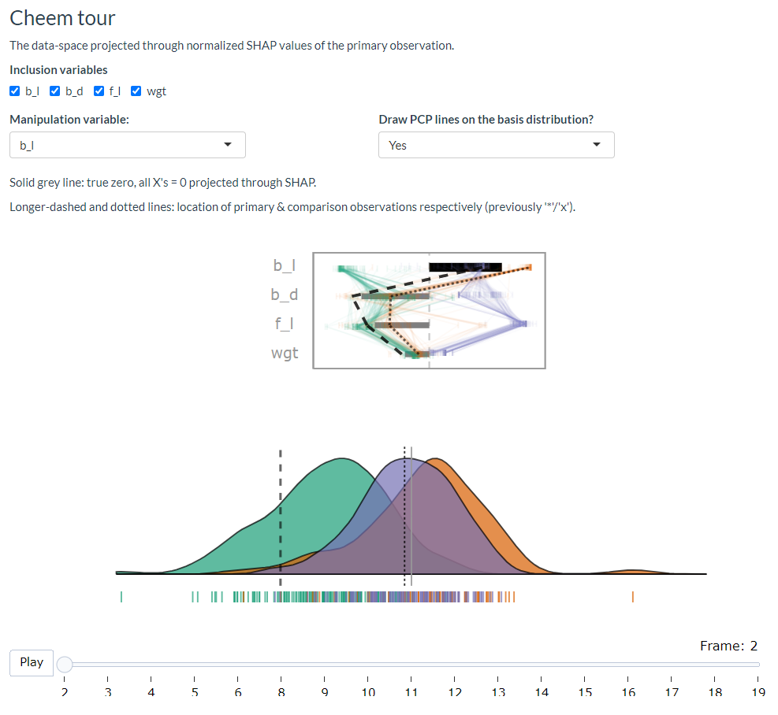

```{r include=FALSE, cache=FALSE}
require("knitr")
require("kableExtra")
require("magrittr")
## Work packages
require("cheem")
require("spinifex")
## chunk options
knitr::opts_chunk$set(
  fig.align = "center",
  echo = FALSE, ## Code
  collapse = TRUE,
  message = FALSE,
  warning = FALSE,
  error = FALSE,
  cache = TRUE,
  cache.lazy = FALSE)
```

<!-- # cheat sheet {#sec:cheatsheet} -->
<!-- A bib reference [@wickham_visualizing_2015]. -->
<!-- A [Section intro](#sec:cheatsheet) reference, alternatively, section {sec:intro} (with no @; \\ref{sec:intro}). -->
<!-- ```{r crest, echo=FALSE, out.height = "10%", out.width = "10%", fig.cap = "A caption for crest figure"} -->
<!-- knitr::include_graphics("./figures/crest.jpg") -->
<!-- ``` -->
<!-- A figure \@ref(fig:crest) reference (with @; \\@ref(fig:crest). -->
<!-- (ref:baseplotcap) Separate caption created above the R chunk -->
<!-- ```{r baseplot, echo=F, fig.cap = "(ref:baseplotcap)"} -->
<!-- plot(1,2) -->
<!-- ``` -->


# Introduction {#sec:intro}
<!-- WHAT TOPICS, and ISSUES addressed (motivation) -->

<!-- ## Predictive models -->
<!-- history of regression and classification -->
Mathematically rigorous approaches to predictive modeling are attributed to the method of least squares, over two centuries ago by Legendre and Gauss in 1805 and 1809 respectively. In 1886 Francis Galton coined the term _regression_ to refer to continuous, quantitative predictions. While _classification_ refers to discrete predictions as introduced by Fisher in 1936.

<!-- introduce explanatory vs predictive modeling -->
Breiman and Shmueli [@breiman_statistical_2001, @shmueli_explain_2010] introduce the idea of distinguishing modeling based on its purpose; _explanatory_ modeling is done for some inferential purpose such as hypothesis testing, while _predictive_ modeling is performed to predict new or future out-of-sample observations. This distinction draws attention to the divide between interpretable models and black-box models. In explanatory modeling, the interpretable is a key feature for drawing inferential conclusions. While predictive modeling may opt for potentially more accurate black-box models. The intended use of a model has important implications for which methods are used and the development of those models.

<!-- ## XAI & interpretability crisis -->
Predictive model and black-box modeling is becoming increasingly common, but not without controversy and issues [@oneil_weapons_2016, @kodiyan_overview_2019]. Applications have been known to reflect common biases against sex [@dastin_amazon_2018, @duffy_apple_2019], race [@larson_how_2016], and age [@diaz_addressing_2018]. This is a common issue stemming from biases in the in-sample, training data are violate ethical principles. Another issue is that of data-drift when new data is outside the support of latent or exogenous explanatory variables. Data-drift can lead to worse predictions [@lazer_parable_2014, @salzberg_why_2014]. Such issues highlight the need to make models fair, accountable, ethical, and transparent which has led to the movement of XAI [@adadi_peeking_2018, @arrieta_explainable_2020].

<!-- ## Local explanations -->
One branch of XAI is local explanations, which take a variable attribution approach to bring transparency to a model. Local explanations attempt to approximate linear variable importance at the location of one observation. There are many such local explanations, any of which is works with our approach (assuming model-explanation compatibility).

<!-- SHAP -->
However, to illustrate our work we apply the model-agnostic explanation SHAP [@strumbelj_efficient_2010, @strumbelj_explaining_2014]. The exact details of SHAP are tangent to the ideas of this work, but suffice it to say that SHAP approximates variable importance by taking the median importance over permutations of the explanatory variables. To be exact we apply a variant that enjoys a lower computational complexity, known as tree SHAP [@lundberg_consistent_2018].
<!-- 2nd half is more application details; move lower? -->

<!-- ## Data visualization tours -->
In multivariate data visualization a _tour_ [@asimov_grand_1985, @buja_grand_1986, @lee_review_2021] is a sequence of linear projections of data onto a lower-dimensional space, typically 1-3D. Tours are viewed as an animation over small changes to a projection basis. Structure in a projection can then be explored visually to see which variables contribute to the formation of the structure. The intuition is similar to watching the shadow of a hidden 3D object change as the object is rotated; watching the structural shape of the shadow change gleans insight into the shape and features of the object. <!-- ## manual tours --> There are various types of tours, which are distinguished by the generation of the sequence of projection bases. In a _manual_ tour [@cook_manual_1997, @spyrison_spinifex_2020] this path is defined by changing the contribution of a selected variable. <!--tours and models --> Applying tours in conjunction with models has been previously done,  _ie_ for exploring various statistical model fits [@wickham_visualizing_2015], and using tree- and forest-based approaches as a projection pursuit index to generate a tour basis path [@lee_pptree_2013, @da_silva_projection_2021].

The approach purposed below is to use the manual tour as means to interrogate a local explanation; a means of evaluating if its variable importance is good explanation for the model predictions. We make R package `cheem` with an interactive application to facilitate analysis. By viewing approximations of data- and attribution-space side-by-side, with linked brushing an analyst can identify observations of interest whose explanations are then rendered at the initial projection basis and explored with a manual tour to further interpret the variable importance of the local explanation. We give case studies of toy and modern datasets for both classification and regression tasks.

The rest of this paper is organized as follows. The next section [SHAP](#sec:SHAP) covers the background of the local explanation SHAP and the traditional visuals produced from it. The section [Application Design](#sec:applicationdesign) discusses the layout of the application, how it facilitates analysis. Following that, [Software Instructure](#sec:softwareinfrastructure) discusses the backend details of the package and preprocessing. The section [Case Studies](#sec:casestudies) illustrates several applications of this method. We conclude with a [Discussion](#sec:discussion) of the insights we draw from classification and regression tasks.


# SHAP local explanation {#sec:SHAP}

<!-- SHAP and history -->
SHaply Additive exPlanations, or SHAP [@lundberg_unified_2017] approximates the variable importance in the vicinity of one observation by taking the median importance of a subset of permutations in the explanatory variables. This idea stems from the field of game theory where Shapley devised a method to evaluate individual's contribution to cooperative games by permuting the players that contribute to the score [@shapley_value_1953].

<!-- An observation's SHAP values were originally used to additvely explain the difference from the intercept to the prediction. This sort of explanation is predicated on the contribution of the previous variables, making it asymmetric across variable ordering.  -->


TO illustrate SHAP and its original use we use soccer data from FIFA 2020 season [@leone_fifa_2020]. We have 5000 observations of 9 aggregated skill measures and use a random forest model to regress the wages, in 2020 Euros, from the skill measures. We then extract the SHAP values of a star offensive player (Messi) and defensive player (van Dijk). We expect to see a difference in the attribution of the variable importance across the two positions of the players.

<!-- Illustration -->
Figure \@ref(fig:shapdistrbd) illustrates the SHAP values of these players. Panel b) shows the underlying distribution of the SHAP attributions while permuting the explanatory variables, with the medians being the SHAP values. In the light of the player position, the difference in the variable importance makes sense; offensive and movement are more important for the offensive player, while defensive and power skills are more important to the model for explaining the prediction of the defensive player. We would likewise expect the profile of variable importance to be unique for star players of other positions as well, such as goalkeepers or middle fielders. Panel c) shows a simplified breakdown plot [@gosiewska_ibreakdown_2019], where a local explanation is used to additively explain the difference from the intercept to the observations prediction. Such additive approaches will show an asymmetry with respect to the variable ordering, so we opt to fix the order to that of panel b), namely, by decreasing the sum of the SHAP values.

```{r shapdistrbd, echo=F, fig.cap = "Illustration of the distribution of SHAP attributions, the SHAP values, and a breakdown plot, the typical visual of SHAP local explanations. For FIFA 2020 data, of a random forest model regressing wages from 9 skill attributes for a star offensive and defensive player. a) The players have very different wages. b) Shows the distributions of the attributions permuting over 25 permutations in the explanatory variables. The median of these distributions are the final SHAP values, notice that that the variable importance differs across the exogenous information of player position. These explanations make sense; the variable importances make sense in light of the position of the player. c) Breakdown plots of the observations the explanation used to additively explain the difference between the intercept and prediction"}
knitr::include_graphics("./figures/shap_distr_bd.pdf")
```

In summary, this highlights how local explanations bring transparency to a model at least in the vicinity of their observations. In this instance, we showed how two very different soccer players receive different profiles of variable importance to explain the prediction of their wages. In the following section, we will be using normalized explanations as the starting projection basis to interrogate the explanation further.


# Application Design {#sec:applicationdesign}

Below we illustrate the two primary displays of the application: the global view and the tour view. Then we'll cover what we take away from the classification and regression tasks. Lastly, we discuss the preprocessing that needs to be done before display.

## Global view

The global view is an important context for exploring the separability of the data- and the local explanation's attribution-spaces, and is crucial in the selection of explanation to further interrogate and explore the structural sensitivity of.

We show an approximation of these spaces with a projection through their first two principal components. The orientation of the variables are shown inscribed on a unit circle. While a single 2D projection will rarely encompass all of the structure of a higher-dimensional space, it provides a reasonable starting point for the real task at hand, the selection of observation and nearby comparison.

```{r globalview, echo=F, out.width = "100%", fig.cap = "Global view screen capture; the approximations of the data and SHAP-spaces of the penguins data. Orientation of the basis contributions is illustrated on a unit circle. Linked brushing allows observations brushed in one plot to be selected in others. This selection is also used in the proceeding view and their corresponding information is displayed in an interactive table. Hovering the cursor over an observation displays a tooltip with row number/name information. In the classification case, misclassified points are circled in red. This view prpvides an orientation to select a primary and comparison observation, key targets in the following tour."}
knitr::include_graphics("./figures/global_view_penguins.PNG")
```

This view offers dynamic interaction in several ways. A tooltip on hovering over a point that displays the row number/name and classification information if appropriate. Linked brushing allows for the selection of points (by click and drag) where those points will be highlighted in both plots. The information corresponding to the selected points is populated on a sortable table and the data powering the proceeding tour will also subset the data to the current selection.


## Cheem tour

The primary observation identified via the global view is foundational to the production of the cheem tour. Namely, the linear attribution of that variable is used as a 1D projection basis. This is the approximate contributions of the variables that this model uses to justify its prediction for the observation.

That normalized attribution of the primary observation is depicted as stacked bars where the horizontal width is the contribution. The bottom of this display is divided by the use case. In the classification case, 1D density curves with underlying rug marks are drawn and colored according to their predicted classes. In the regression case, the horizontal position of the points comes from projection through the 1D attribution basis while the vertical position of the observations is fixed to its prediction or residual.

```{r cheemtour, echo=F, out.width = "100%", fig.cap = "Cheem tour screen capture; the primary observation's normalized SHAP values are the initial basis. This is the explanation of the linear variable importances for the model at this observation. The point in question was misclassified, it was predicted to be from the green cluster, while it was observed to be from the orange cluster. The top shows the contributions of the variables, with the dashed line being the primary observation's SHAP, its shape is closer to the orange cluster (observed group) while the position is pulled more toward the green (predicted group). The bottom shows the 1D projection with density and rug marks below. The dashed line is plausibly in the middle of the green density, the story that the explanation trying to sell us. Yet, when we play the tour animating on the contribution of bill length (b_l), the bottom dashed line is more regularly in the center of the observed orange cluster."}

```

Data visualization tours animate many linear projections over small changes to the basis. The manual tour creates a basis path by varying the contribution of a selected variable, fully into and out of a projection frame. Doing allows an analyst to test an individual variable's sensitivity to the structure identified in the frame. The default variable selected is the one with the largest discrepancy between the primary and comparison observation's attribution. In the following sections we elaborate on the takeaways we draw from applying this approach in classification and regression tasks respectively.

## Classifcation task

What information do we glean from using this method on a classifcation task?  Typically we select a misclassified observation in comparison with correctly classified point that is nearby in data space. We start by seeing the data projected through the linear attribution, the combination that best justifies that prediction. By default the manual tour varies the contribution of the variable with the largest difference between the primary and comparison observation. That is, we can test the sensitivity of each variable to structure identified by the local explanation, we are exploring the support of the explanation, evaluating the support or robustness of the prediction. 

Another way of thinking about this would be: what would the predictions be if the explanation were different. This is similar to the idea of _ceteris paribus_ profiles [@biecek_ceterisparibus_2020]. _Ceteris paribus_ is Latin for “other things held constant” or “all else unchanged”. The profiles visualize what 'what-if' analysis, showing how an observation's prediction would change from a change in one explanatory variable given that other other variables are all held constant. In contrast to _ceteris paribus_ profiles, touring methods visualize all observations rather than one, and variables are not treated as independent, that is the projection has an orthonormal basis; when one variable is rotated out-of-frame, other variables are effectively rotated into-the-frame.

## Regression task

The regression case is not as discrete a feature. Instead the prediction or the residual becomes the comparison of accuracy. 

## Preprocessing

The benefit of having dynamic interaction with data is predicated on a reasonably small render time. It is important to preprocess as much work as possible so that application resources can be used efficiently. The work remaining at runtime should be solely responding to inputs and the rendering of figures and tables. Below we discuss the steps and details of the reprocessing.

(ref:citeRf) [@liaw_classification_2002]
(ref:citeTs) [@kominsarczyk_treeshap_2021]
\begin{itemize}
	\item \textbf{Data:} a complete numerical matrix; explanatory and response variable, an optional aesthetic (color/shape) variable can be mapped typically a categorical variable exogenous to the model.
	\item \textbf{Model:} any model can be used with this method. Currently, we apply random forest models via the package \textbf{randomForest} (ref:citeRf) to mitigate the runtime of our local explanation which requires tree-based models.
	\item \textbf{Local explanation:} any model-compatible linear explanation could be used. We apply tree SHAP, a more computationally efficient variant of SHAP applicable to tree-based models. This is done with the package \textbf{treeshap} (ref:citeTs), hosted on GitHub only]. The global view shows all observations in attribution space requiring that we must extract the variable weightings from \emph{all} observations rather than just one.
	\item \textbf{Global view:} The data- and attribution-spaces are approximated as their the first two principal components.
\end{itemize}

<!-- note on time of execution -->
The time to preprocess the data will vary significantly with the choice of model and local explanation. However, for reference, the FIFA data, 5000 observations of 9 explanatory variables, took 0.6 seconds to create PCA for both the data and attribution spaces. On the same data, a modestly hyper-parametered random forest model fit in 2.9 seconds, while extracting the tree SHAP values of each observation took 254 seconds combined. These runtimes were from a non-parallelized R session on a modern laptop, but suffice it to say that the bulk of the run time will be spent on the local attribution. This makes tree SHAP a good candidate to start with. The package __fastshap__ [@greenwell_fastshap_2020] claims extremely low runtimes that are attributed to fewer calls to the prediction function, partial implementation in C++, and efficient use of logical subsetting.


# Software Infrastructure {#sec:softwareinfrastructure}

The above described method and application are implemented as an open source __R__ package, __cheem__ _TODO:XXX site github? cran?_. Preprocessing was facilited with models created via __randomForest__ [liaw_classification_2002], and explanations calculated with __treeshap__ [@kominsarczyk_treeshap_2021].
The application is made with __shiny__ [@chang_shiny_2021]. The tour visual is an extension of __spinifex__ [@spyrison_spinifex_2020]. Both views are created first with first with __ggplot2__ [@wickham_ggplot2_2016] and then rendered as interactive html widget with __plotly__ [@sievert_interactive_2020]. The free ebook, _Explanatory Model Analysis_ [@biecek_explanatory_2021] was a huge boon to understanding local explanations and how to apply them.

## Preprocessing

Provided with tidy and transformed data, the function `cheem_ls` is a wrapper function that facilitates the creation of random forest models and calculates the tree SHAP for all observations. It returns an a list containing data frames to be consumed by the application, higher level model performance, and runtime information. The return of this function can be then be saved to an .rds file for consumption in the application.

## Linking brushing and highlighting

The dynamic interaction with the global view is critical to the selection of the primary and comparison observations. Linked brushing also for a rectangular selection of observations. These points are highlighted within the other space of the global view _and_ crucially available for downstream consumption, for instance highlighting in the tour. The distinction between the former and latter is subtle, but important for developers to grasp. In the former, self-contained html widgets can highlight directly within javascript without evaluation evaluation downstream in other reactive functions. In the latter, the use of `plotly::event_data()` returns the identity of the selected observations. This will require a reactive flush, but after that, the sky is the ceiling.

# Case Studies {#sec:casestudies}
## 1) penguins, species classification

```{r casepenguins, echo=F, out.width = "100%", fig.cap = "Penguins classificiation TODO: XXX"}
knitr::include_graphics("./figures/case_penguins.pdf")
```

## 2) Chocolates, milk/dark chocolate classification

TODO:XXX

## 3) FIFA, wage regression
```{r casefifa, echo=F, out.width = "100%", fig.cap = "FIFA 2020, regressing wages [log 2020 Euros] from skill measures. TODO: XXX"}
knitr::include_graphics("./figures/case_fifa.pdf")
```

## 4) Coffee, rating regression

TODO:XXX


regress score color on species?

# Discussion {#sec:discussion}

# Acknowledgments

We would like to thank Professor Przemyslaw Biecek for his input in early in the project and to the broader MI\^2 lab group for the __DALEX__ ecosystem of __R__ and __Pyhton__ packages. This research was supported in part by Australian government Research Training Program (RTP) scholarships.


# References
