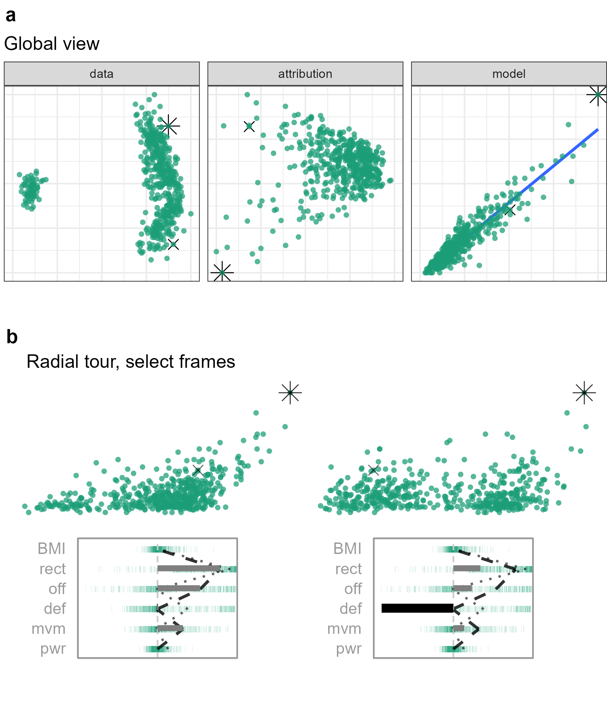

```{r include=FALSE, cache=FALSE}
require("knitr")
require("kableExtra")
require("magrittr")
## Work packages
require("cheem")
require("spinifex")
## chunk options
knitr::opts_chunk$set(
  fig.align = "center",
  echo = FALSE, ## Code
  collapse = TRUE,
  message = FALSE,
  warning = FALSE,
  error = FALSE,
  cache = TRUE,
  cache.lazy = FALSE)
```

<!-- # cheat sheet {#sec:cheatsheet} -->
<!-- A bib reference [@wickham_visualizing_2015]. -->
<!-- A [Section intro](#sec:cheatsheet) reference, alternatively, section {sec:intro} (with no @; \\ref{sec:intro}). -->
<!-- ```{r crest, echo=FALSE, out.height = "10%", out.width = "10%", fig.cap = "A caption for crest figure"} -->
<!-- knitr::include_graphics("./figures/crest.jpg") -->
<!-- ``` -->
<!-- A figure \@ref(fig:crest) reference (with @; \\@ref(fig:crest). -->
<!-- (ref:baseplotcap) Separate caption created above the R chunk -->
<!-- ```{r baseplot, echo=F, fig.cap = "(ref:baseplotcap)"} -->
<!-- plot(1,2) -->
<!-- ``` -->


# Introduction {#sec:intro}
<!-- WHAT TOPICS, and ISSUES addressed (motivation) -->

<!-- ## Predictive models -->
<!-- history of regression and classification -->
Mathematically rigorous approaches to predictive modeling are attributed to the method of least squares, over two centuries ago by Legendre and Gauss in 1805 and 1809 respectively. In 1886 Francis Galton coined the term _regression_ to refer to continuous, quantitative predictions. While _classification_ refers to discrete predictions as introduced by Fisher in 1936.

<!-- introduce explanatory vs predictive modeling -->
Breiman and Shmueli [@breiman_statistical_2001, @shmueli_explain_2010] introduce the idea of distinguishing modeling based on its purpose; _explanatory_ modeling is done for some inferential purpose such as hypothesis testing, while _predictive_ modeling is performed to predict new or future out-of-sample observations. This distinction draws attention to the divide between interpretable models and black-box models. In explanatory modeling, the interpretable is a key feature for drawing inferential conclusions. While predictive modeling may opt for potentially more accurate black-box models. The intended use of a model has important implications for which methods are used and the development of those models.

<!-- ## XAI & interpretability crisis -->
Black-box models are becoming increasingly common, but not without their share of controversy and issues [@oneil_weapons_2016, @kodiyan_overview_2019]. Applications have been known to reflect common biases against sex [@dastin_amazon_2018, @duffy_apple_2019], race [@larson_how_2016], and age [@diaz_addressing_2018]. These are all-too common of an issue, when endogenous or exogenous biases in the training data and identified and mimicked by models. Another issue is that of data drift when new data is outside the support of latent or exogenous explanatory variables. Data drift can lead to worse predictions [@lazer_parable_2014, @salzberg_why_2014]. Such issues highlight the need to make models fair, accountable, ethical, and transparent which has led to the movement of XAI [@adadi_peeking_2018, @arrieta_explainable_2020].

<!-- ## Local explanations -->
One branch of XAI is local explanations, which take a variable attribution approach to bring transparency to a model. Local explanations attempt to approximate linear variable importance at the location of one observation. There are many such local explanations, any of which is works with our approach (assuming model-explanation compatibility).

<!-- SHAP -->
To illustrate our work we apply the model-agnostic explanation SHAP [@strumbelj_efficient_2010, @strumbelj_explaining_2014]. The exact details of SHAP are tangent to the ideas of this work, but suffice it to say that SHAP approximates variable importance by taking the median importance over permutations of the explanatory variables. To be exact we apply a variant that enjoys a lower computational complexity, known as tree SHAP [@lundberg_consistent_2018].
<!-- 2nd half is more application details; move lower? -->

<!-- ## Data visualization tours -->
In multivariate data visualization a _tour_ [@asimov_grand_1985, @buja_grand_1986, @lee_review_2021] is a sequence of linear projections of data onto a lower-dimensional space, typically 1-3D. Tours are viewed as an animation over small changes to a projection basis. Structure in a projection can then be explored visually to see which variables contribute to the formation of the structure. The intuition is similar to watching the shadow of a hidden 3D object change as the object is rotated; watching the structural shape of the shadow change gleans insight into the shape and features of the object. 

<!-- ## manual tours --> 
There are various types of tours, which are distinguished by the sequence of projection bases. In a _manual_ tour [@cook_manual_1997, @spyrison_spinifex_2020] this path is defined by changing the contribution of a selected variable. <!--tours and models --> Applying tours in conjunction with models has been done in a couple contexts, _ie_ for exploring various statistical model fits [@wickham_visualizing_2015], and using tree- and forest-based approaches as a projection pursuit index to generate a tour basis path [@lee_pptree_2013, @da_silva_projection_2021].

<!-- Purposed approach -->
The approach purposed below is to use the manual tour as means to interrogate a local explanation; a means of evaluating if its variable importance is a good explanation for the model predictions. We provide a free and open-source R package `cheem` with an interactive application to facilitate analysis. By viewing approximations of data- and attribution-space side-by-side, with linked brushing an analyst can identify observations of interest whose explanations are then rendered at the initial projection basis and explored with a manual tour to further interpret the variable importance of the local explanation. We give case studies of toy and modern datasets for both classification and regression tasks.

<!-- What-if & counterfactual analysis -->
The change in the projection basis might feel similar to counterfactual, what-if analysis, such as _Ceteris paribus_[@biecek_ceterisparibus_2020]. Latin for “other things held constant” or “all else unchanged”, is a counterfactual analysis showing how an observation's prediction would change from a change in one explanatory variable given that other variables are held constant. It ignores correlations of the variables and imagines a case that was not observed. In contrast, our approach is a geometric explanation a of the factual observed case by varying the basis, the angle of the data object. Another, but related difference is that this geometric approach maintains orthogonal dimensions. That is to say when the contribution of some variables decrease the the contributions of others necessarily increases.

The rest of this paper is organized as follows. The next section [Local explanation statistics](#sec:explanations) covers the background of the local explanation SHAP and the traditional visuals produced from it. [Tours and the radial tour](#sec:tour) digs deeper into the animation and what it shows. The section [Application Design](#sec:applicationdesign) discusses the layout of the application, how it facilitates analysis and discusses the backend details of the package and preprocessing. The section [Case Studies](#sec:casestudies) illustrates several applications of this method. We conclude with a [discussion](#sec:discussion) of the insights we draw from classification and regression tasks.


# Local explanation statistics {#sec:explanations}

<!-- reminder of local explanation -->
Consider a highly non-linear model. At face value its hard to say which variable are sensitive to the crossing of classification boundary or identify which variables caused an observation to have a relatively extreme residual. Local explanations shed light on these cases by approximating linear variable importance at in vicinity of one observation.

<!-- Taxonomy of local explanations -->
Figure 6 of @arrieta_explainable_2020 gives a broad summarization of the taxonomy and literature of explanation techniques. This includes a large number of model-specific explanations such as deepLIFT, [@shrikumar_not_2016, @shrikumar_learning_2017] a popular recursive method for estimating importance in neural networks. There are a fewer number of model-agnostic explanations, of which LIME, [@ribeiro_why_2016] SHAP, [@lundberg_unified_2017] and their variants are popular.

<!-- Uses of local explanations -->
These local explanation are used in a variety of ways depending on the data. For images saliency maps [@simonyan_deep_2014] a heatmap can be used to show which pixels were important for distinguishing pictures of wolfs or huskies for instance. In text analysis saliency can be used to highlight influential words [@vanni_textual_2018]. In the case of numeric regression they can be used to explain variable additive contributions from intercept to prediction [@ribeiro_why_2016].


## SHAP and tree SHAP

<!-- SHAP and history -->
SHaply Additive exPlanations, or SHAP approximates the variable importance in the vicinity of one observation by taking the median importance of a subset of permutations in the explanatory variables. This idea stems from the field of game theory where Shapley devised a method to evaluate individual's contribution to cooperative games by permuting the players that contribute to the score [@shapley_value_1953].

To illustrate SHAP and its original use, explaining the difference between the intercept and an observation's prediction, we use soccer data from FIFA 2020 season [@leone_fifa_2020]. We have 5000 observations of 9 skill measures (after aggregating variable with high correlation). A random forest model is fit to regress the log wages, in 2020 Euros, from the skill measures. We then extract the SHAP values of a star offensive player (L. Messi) and defensive player (V. van Dijk). We expect to see a difference in the attribution of the variable importance across the two positions of the players.

<!-- Illustration -->
Figure \@ref(fig:shapdistrbd) shows the SHAP values of these players. Panel a) shows these players recieve a sizable difference in wages. Panel b) shows the underlying distribution of the SHAP attributions while permuting the explanatory variables, with the medians being the SHAP values. In the light of the player position, the difference in the variable importance makes sense; offensive and movement are more important for the offensive player, while defensive and power skills are more important to the model for explaining the prediction of the defensive player. We would likewise expect the profile of variable importance to be unique for star players of other positions as well, such as goalkeepers or middle fielders. Panel c) shows a simplified breakdown plot [@gosiewska_ibreakdown_2019], where a local explanation is used to additively explain the difference from the intercept to the observations prediction. Such additive approaches will show an asymmetry with respect to the variable ordering, so we opt to fix the order to that of panel b), namely, by decreasing the sum of the SHAP values.

```{r shapdistrbd, echo=F, fig.cap = "Illustration of the distribution of SHAP attributions, the SHAP values, and a breakdown plot, the typical visual of SHAP local explanations. For FIFA 2020 data, of a random forest model regressing wages from 9 skill attributes for a star offensive and defensive player. a) The players have very different wages. b) Shows the distributions of the attributions permuting over 25 permutations in the explanatory variables. The median of these distributions are the final SHAP values, notice that that the variable importance differs across the exogenous information of player position. These explanations make sense; the variable importances make sense in light of the position of the player. c) Breakdown plots of the observations the explanation used to additively explain the difference between the intercept and prediction"}
knitr::include_graphics("./figures/shap_distr_bd.png")
```

In summary, this highlights how local explanations bring interpretability to a model at least in the vicinity of their observations. In this instance, we showed how two very different soccer players receive different profiles of variable importance to explain the prediction of their wages. In the following section, we will be using normalized explanations as the starting projection basis to interrogate the explanation further.

# Tours and the radial tour

TODO:XXX
```{r}
##TODO:XXX
```

# Application design {#sec:applicationdesign}

Below we illustrate the two primary displays of the application: the global view and the tour view. Then we'll cover what we take away from the classification and regression tasks. Lastly, we discuss the preprocessing that needs to be done before display.

## Classification task

What information do we glean from using this method on a classification task? Typically we select a misclassified observation in comparison with a correctly classified point that is nearby in data space. We start by seeing the data projected through the linear attribution, the combination that best justifies that prediction. By default, the manual tour varies the contribution of the variable with the largest difference between the primary and comparison observation. That is, we can test the sensitivity of each variable to structure identified by the local explanation, we are exploring the support of the explanation, evaluating the support or robustness of the prediction. 


## Regression task

The regression case is not as discrete a feature. Instead, we find it more meaningful to compare the observed value or  residual with the projection. In this case the horizontal positions are the same, that is projection of the data through the attribution of the explanation and then varying as the radial tour changes the contributions of the selected variable. While the height of the points is fixed to the fixed either to the observed y and residuals for the middle and right panels respectively.


## Global view

<!-- purpose -->
The global view is an important context for exploring the separability of the data- and the local explanation's attribution-spaces, and is crucial in the selection of explanation to further interrogate and explore the structural sensitivity of.

<!-- approximations of the spaces, PC1:2 -->
We show an approximation of these spaces with a projection through their first two principal components. The orientation of the variables is shown inscribed on a unit circle. While a single 2D projection will rarely encompass all of the structure of higher-dimensional spaces, it provides a reasonable starting point for the real task at hand, the selection of observation and nearby comparison.

<!-- predicted by observed -->
It is insightful to explore these two approximations against a visual of the model; prediction by observation is added. Linked brushing and preserved aesthetic features such as circling misclassifed observations helps link information from the different spaces together.

```{r globalview, echo=F, out.width = "100%", fig.cap = "Global view screen capture; the approximations of the data and SHAP-spaces of Palmer penguins data. Orientation of the basis contributions is illustrated on a unit circle. Linked brushing allows observations brushed in one plot to be selected in others. This selection is also used in the proceeding view and their corresponding information is displayed in an interactive table. Hovering the cursor over an observation displays a tooltip with row number/name information. In the classification case, misclassified points are circled in red. This view provides an orientation to select a primary and comparison observation, key targets in the following tour."}
knitr::include_graphics("./figures/global_view_toy_class.PNG")
```

<!-- Interaction -->
This view offers dynamic interaction in several ways. A tooltip displays while the cursor hovers over a point displays the row number/name and classification information if appropriate. Linked brushing allows for the selection of points (by click and drag) where those points will be highlighted in both plots. The information corresponding to the selected points is populated on a sortable table and the data powering the proceeding tour will also subset the data to the current selection.


## Cheem tour

<!-- a function of the obs selected above -->
The primary observation identified via the global view is foundational to the production of the cheem tour. Namely, the linear attribution of that variable is used as a 1D projection basis. This is the approximate contributions of the variables that this model uses to justify its prediction for the observation.

<!-- Dupiction of a frame -->
The SHAP values of the full dataset are shown as horizontal parrallel coordiate plot at the top with the selected observations highlighted. In the classification case, 1D density curves with underlying rug marks are drawn and colored according to their predicted classes. In the regression case, the horizontal position of the points comes from projection through the 1D attribution basis while the vertical position of is fixed to the observations prediction and residual respectively. The current projection basis is depicted on the bottom, where the width of the bar is mapped to variables contribution to the horizontal axis. The starting frame is the normalized SHAP values of the primary observation. In figure \@ref(fig:cheemtourclass) we illustrate the classification case with simulated data; 3 clusters separated in the first 2 dimensions with 2 dimensions of noise.

<!-- cheem tour classification caption -->
(ref:cheemtourclass) Cheem tour, classification case. A random forest model predicting the class of the of simulated data. A misclassified observation is be compared with a nearby correctly classified observation. The top shows density and rug marks of the current frame with the positions of the primary and comparison observations shown as dashed and dotted lines. The bottom shows two key features; the distribution of attribution space shown as parallel coordinate lines across the variables and the bars show the current contribution of the variable to the projection. The primary, misclassifed observation (dashed line), is plausibly in the middle of the its prediction,  purple density, the story that the explanation trying to sell us. Yet, when we play the tour animating on the contribution of V1, the bottom dashed line is more regularly in the center the it observed cluster, green, By varying this contribution we gain information of how sensitive this variable is to the explanation; the variable importance which led to a misclassification.

```{r cheemtourclass, echo=F, out.width = "100%", fig.cap = "(ref:cheemtourclass)"}
knitr::include_graphics("./figures/cheem_tour_toy_class.PNG")
```

<!-- tour animation -->
Data visualization tours animate many linear projections over small changes to the basis. The manual tour creates a basis path by varying the contribution of a selected variable, fully into and out of a projection frame. Doing allows an analyst to test an individual variable's sensitivity to the structure identified in the frame. The default variable selected is the one with the largest discrepancy between the primary and comparison observation's attribution. In the following sections we elaborate on the takeaways we draw from applying this approach in classification and regression tasks respectively.

<!-- regression case -->
In the regression case we compare an observation with a particularly extreme residual as compared with a neighboring point that is more  accurately predicted. The global tour is primarily the same without the misclassified circles, but the tooltip now shows the observation's residual. We simulate data, 5 variable from the uniform distribution (between 0 and 5) and $y = x1 + x2 + x1*x2 + (x3 + x4 + x5) / 10 + \epsilon$. We fit a random forest and extract the all tree SHAP values. The first thing we notice from the global view is the shape difference between the data- and attribution-spaces, which are primarily circular are triangular respectively. We also see that the random forest fit the data quite well viewing the predictions across the observations. Though linked brushing we find that the attribution space is highly correlated with the $y$ value. The highest values occupy 1 corner of the triangle, the lowest values cluster on the opposite side and the middle values form a ')' shape filling out the triangle in attribution space. In the regression case the tour view is a bit different, this is illustrated in figure \@ref(cheemtourreg). The the current frames basis and distribution are shown to the left. The horizontal positions of the two scatter plots are the resulting 1D projection of the basis while the heights are fixed to the observed y and the residuals.

<!-- tour regression caption -->
(ref:cheemtourreg) Cheem tour, regression case. A random forest model predicting the continuous $y$ of the of simulated data where $y = x1 + x2 + x1*x2 + (x3 + x4 + x5) / 10 + \epsilon$. The current frames basis and the distribution of all attributions is shown on the left. The horizontal positions for the scatterplots are resulting projection through the 1D basis while the vertical heights are fixed to the observed y and residuals respectively.

```{r cheemtourreg, echo=F, out.width = "100%", fig.cap = "(ref:cheemtourreg)"}
knitr::include_graphics("./figures/cheem_tour_toy_reg.PNG")
```

Now that we have covered the classification and regression cases we will discuss the preprocessing, package infrastructure, and interactive features before proceeding to case studies with data from the wild.

## Interactive features

The dynamic interaction with the global view is critical to the selection of the primary and comparison observations. Linked brushing also for a rectangular selection of observations. These points are highlighted within the other space of the global view _and_ crucially available for downstream consumption, for instance, highlighting in the tour. The distinction between the former and latter is subtle, but important for developers to grasp. In the former, self-contained HTML widgets can highlight directly within javascript without evaluation downstream in other reactive functions. In the latter, the use of `plotly::event_data()` returns the identity of the selected observations. This will require a reactive flush, but after that, the sky is the ceiling.


## Preprocessing

The benefit of having dynamic interaction with data is predicated on a reasonably small render time. It is important to preprocess as much work as possible so that application resources can be used efficiently. The work remaining at runtime should be solely responding to inputs and the rendering of figures and tables. Below we discuss the steps and details of the reprocessing.

(ref:citeRf) [@liaw_classification_2002]
(ref:citeTs) [@kominsarczyk_treeshap_2021]
\begin{itemize}
	\item \textbf{Data:} a complete numerical matrix; explanatory and response variable, an optional aesthetic variable (color/shape)  can be mapped typically a categorical variable.
	\item \textbf{Model:} any model can be used with this method. Currently, we apply random forest models via the package \textbf{randomForest} (ref:citeRf) to mitigate the runtime of our local explanation which requires tree-based models.
	\item \textbf{Local explanation:} any model-compatible linear explanation could be used. We apply tree SHAP, a more computationally efficient variant of SHAP applicable to tree-based models. This is done with the package \textbf{treeshap} (ref:citeTs), hosted on GitHub only]. The global view shows all observations in attribution space requiring that we must extract the variable weightings from \emph{all} observations rather than just one.
	\item \textbf{Global view:} The data- and attribution-spaces are approximated as their the first two principal components.
\end{itemize}

<!-- note on time of execution -->
The time to preprocess the data will vary significantly with the choice of model and local explanation. However, for reference, the FIFA data, 5000 observations of 9 explanatory variables, took 0.6 seconds to create PCA for both the data and attribution spaces. On the same data, with modest hyper parameters a random forest model fit in 2.9 seconds while extracting the tree SHAP values of each observation took 254 seconds combined. These runtimes were from a non-parallelized R session on a modern laptop, but suffice it to say that the bulk of the time will be spent on the local attribution. This makes tree SHAP a good candidate to start with. The package __fastshap__ [@greenwell_fastshap_2020] claims extremely low runtimes that are attributed to fewer calls to the prediction function, partial implementation in C++, and efficient use of logical subsetting.


## Package infrastructure {#sec:infrastructure}

The above-described method and application are implemented as an open-source __R__ package, __cheem__ _TODO:XXX site github? cran?_. Preprocessing was facilitated with models created via __randomForest__ [liaw_classification_2002], and explanations calculated with __treeshap__ [@kominsarczyk_treeshap_2021].
The application is made with __shiny__ [@chang_shiny_2021]. The tour visual is an extension of __spinifex__ [@spyrison_spinifex_2020]. Both views are created first with first with __ggplot2__ [@wickham_ggplot2_2016] and then rendered as interactive HTML widgets with __plotly__ [@sievert_interactive_2020]. __DALEX__ [@biecek_dalex_2018] and 
the free ebook, _Explanatory Model Analysis_ [@biecek_explanatory_2021] was a huge boon to understanding local explanations and how to apply them.

Installation and get started with the package can be acheived by running the following in __R__:

```{r eval=FALSE, echo=TRUE}
## Download the package:
install.packages("cheem", dependencies = TRUE)
## Try the app yourself:
cheem::run_app()
## Procss your own data for the app by following the examples in:
?cheem::cheem_ls
```

<!-- Provided with tidy and transformed data, the function `cheem_ls` is a wrapper function that facilitates the creation of random forest models and calculates the tree SHAP for all observations. It returns a list containing data frames to be consumed by the application, higher-level model performance, and runtime information. The return of this function can be then be saved to an .rds file for consumption in the application. -->


# Case studies {#sec:casestudies}

To illustrate the use of the cheem method we apply it to modern datasets, two classification examples and then two of regression. 

## 1) penguins, species classification

Palmer penguins data [@gorman_ecological_2014, @horst_palmerpenguins_2020] consist of 330 observations across four physical measurements of 3 species of penguins foraging near Palmer Station, Antarctica. A random forest model was fit, classifying the species of the penguin given the physical measurements. 

```{r casepenguins, echo=F, out.width = "100%", fig.cap = "Species classification of Palmer penguin data."}
knitr::include_graphics("./figures/case_penguins.png")
```

In figure \@ref(fig:casepenguins) a misclassified point is contrasted with a correctly classified point of its observed class that is nearby in data-space. The attribution space from the treeshap local explanations is a more separable space, where the comparison is squarely in the middle of the orange distribution while primary observation is in-between the predicted and observed clusters, a sign of uncertainty in the prediction. The tour varies the contribution of bill length (b_l) as this variable differs most from the contribution of the comparison observation. Downplaying the contribution of bill length is crucial to linear explanation this observation be misclassified.

## 2) Chocolates, milk/dark chocolate classification

The chocolates dataset consists of 88 observations of 10 nutritional measurements from their labels. Each of which was labeled as being either milk or dark chocolates. With this data, we can see if a manufacturer is giving an accurate portrayal of the chocolate. We are curious to see if there are chocolates that nutritionally look like milk chocolates that are labeled as dark chocolates, which may hold a higher market value. We should note that not all chocolates consist wholly of chocolate. The addition of other ingredients will decrease the predictive power of the model nutritional explanatory variable. A random forest model is fit classifying the type of chocolate. We'll select chocolate labeled dark, through predicted to be milk chocolate with a comparison with a chocolate labeled 85% cocoa.

```{r casechocolates, echo=F, out.width = "100%", fig.cap = "Chocolates data  type classification (milk or dark). "}
knitr::include_graphics("./figures/case_chocolates.png")
```

From figure \@ref(fig:casechocolates) we similarly see that attribution space that is more separable relative to data-space. Interestingly there is not the class imbalance that we suspected; there are only 6 chocolates labeled as dark and predicted as milk, while there 8 of the inverse case. Calories from fat is the measure with the largest difference in treeshap attribution between these points.


## 3) FIFA, wage regression

The 2020 season FIFA[@leone_fifa_2020, @biecek_dalex_2018], contains many skill measurements of soccer/football players along with wage information. After aggregation of the skill measurements, we regress the log wages [2020 euros] given just the skill aggregates. The model was fit with 5000 observations of the 9 skill aggregates before being thinned to 500 players to gate occlusion and render time. We compare a leading offensive fielder (L. Messi) with that of a leading defensive fielder (V. van Dijk), the same observations used in figure \@figure(fig:shapdistrbd).

```{r casefifa, echo=F, out.width = "100%", fig.cap = "FIFA 2020, regressing log wages [2020 Euros] from aggregations of skill measurements. The primary observation is star offensive player (L. Messi) as compared with a top defensive player (V. van Dijk)."}

```

With figure \@ref(fig:casefifa) we are going to test the premise of the local explanation. If we remove reaction and movement skills from the basis, then offense has almost singular importance for the explanation of the offensive player. We vary the contribution of offensive skills. In the tour (3rd frame of b), offensive skills moved, and Messi is no longer separated from the group. We also notice that accuracy has rotated into the frame, which does maintain some separability.

## 4) Ames housing prices 2018

Ames 2018, housing data was subset to North Ames (neighborhood with the most house sales). The remaining are 338 house sales across 9 variables. Using interaction from the global view we select a house with an extreme negative residual and an accurate observation close to it in the data.

```{r caseames, echo=F, out.width = "100%", fig.cap = "Ames housing 2018 regressing log sales price [2018 USD]."}
knitr::include_graphics("./figures/case_ames2018.png")
```

Figure \@ref(fig:caseames) shows the global view and extrema of the tour. The horizontal distance in the tour didn't show a large disparity between our selected points. This is not particularly surprising as most of the features have a sizable contribution. Rotating any one variable out of the frame will rotate other important variables into frame preserving most of the distance from intercept to prediction. However, the tour has revealed an interesting feature worth discussing. notice that the observations pivot about the origin, that is the basis roughly halfway between bases in frame 1 and 2 of panel b) the data is near a singular profile. This means that there is a basis orthogonal to this point that describes a lot of the variation. Knowing these singular frames can help direct to bases that have meaningful variation in the data.


# Discussion {#sec:discussion}

The need to maintain the interpretability of black-box models is clear. One way to do this is by the use of local explanations of an observation. Local explanations approximate the linear variable importance to the model. Our idea is to visualize approximations of the data and explanation spaces side-by-side, using dynamic interaction to compare and contrast, and ultimately, identify primary and comparison observations of interest. Then use the linear importance from the primary observation as a projection basis and explore a single variable's importance to the structure identified with the use of the manual tour.

We have illustrated this method on random forest models using the tree SHAP local explanation, while it could be generalized to any compatible model-explanation pair. We apply this to both the classification and regression tasks. In the former, it can be used to see which variables cause a misclassification as benchmarked against a nearby observation and explore changing the contribution of variables. In the regression case, we compare an observation with particularly extreme residual can be compared with nearby points more accurately predicted or another suitable benchmark.

We have created an open-source __R__ package __cheem__, available on CRAN, to facilitate this workflow including a dynamic application, with the ability to upload preprocessed data.


# Acknowledgments

We would like to thank Professor Przemyslaw Biecek for his input early in the project and to the broader MI\^2 lab group for the __DALEX__ ecosystem of __R__ and __Pyhton__ packages. This research was supported in part by Australian government Research Training Program (RTP) scholarships.

The namesake, Cheem, refers to a fictional race of humanoid trees in  Doctor Who lore. Given that __DALEX__ pulls on from that universe and we originally apply tree SHAP explanations (specific to tree-based models) we found it fitting.


# References
