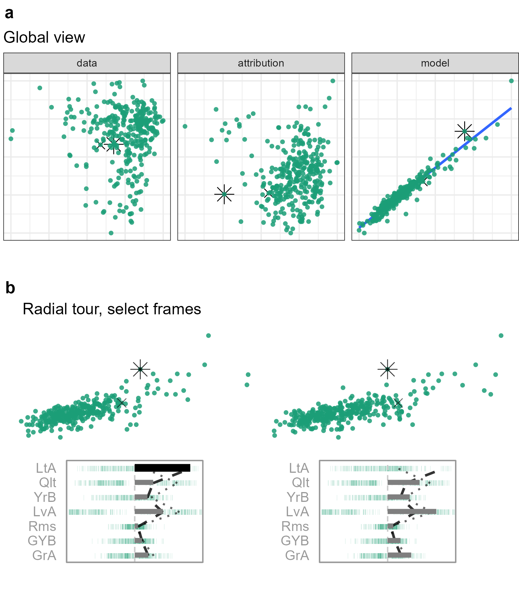

```{r loadlibraries, include=FALSE, cache=FALSE}
library("knitr")
library("kableExtra")
library("magrittr")
## Work packages
library("cheem")
library("spinifex")
## chunk options
knitr::opts_chunk$set(
  fig.align  = "center",
  echo       = FALSE,
  collapse   = TRUE,
  message    = FALSE,
  warning    = FALSE,
  error      = FALSE,
  cache      = TRUE,
  cache.lazy = FALSE)
```
<!-- bookdown::pdf_document2: allows \@ref(), pdf_document: requires \ref{} -->
<!-- # cheat sheet {#sec:cheatsheet} -->
<!-- A bib reference [@wickham_visualizing_2015]. -->
<!-- A [Section intro](#sec:cheatsheet) reference, alternatively, section \@ref(sec:intro) (with @; \\@ref(sec:intro)). -->
<!-- ```{r crest, echo=FALSE, out.height = "10%", out.width = "10%", fig.cap = "A caption for crest figure"} -->
<!-- knitr::include_graphics("./figures/crest.jpg") -->
<!-- ``` -->
<!-- A figure \@ref(fig:crest) reference (with @; \\@ref(fig:crest). -->
<!-- (ref:baseplotcap) Separate caption created above the R chunk -->
<!-- ```{r baseplot, echo=F, fig.cap = "(ref:baseplotcap)"} -->
<!-- plot(1,2) -->
<!-- ``` -->

# Introduction {#sec:intro}

<!-- Introduce explanatory vs predictive modeling -->
There are different reasons and emphases to fit a model. @breiman_statistical_2001, reiterated by @shmueli_explain_2010, taxonomizes modeling based on its purpose; _explanatory_ modeling is done for some inferential purpose, while _predictive_ modeling focuses more on the predictions of out-of-sample instances. The intended use has important implications for model selection and development. In explanatory modeling, interpretability is vital for drawing inferential conclusions. While predictive modeling may opt for more accurate non-linear models. The use of black-box models is becoming increasingly common, but not without their share of controversy [@oneil_weapons_2016; @kodiyan_overview_2019]. However, the loss of interpretation presents a challenge.

<!-- Interpretability & baises -->
Interpretability is vital for exploring and protecting against potential biases (e.g. sex [@dastin_amazon_2018; @duffy_apple_2019], race [@larson_how_2016], and age [@diaz_addressing_2018]) in any model. For instance, models regularly pick up on biases in the training data that have observed influence on the response (output) feature, which is then built into the model. Feature-level (variable-level) interpretability of models is essential in the evaluation models for such biases. It is also generally important for many problems, where it is not enough to accurately predict accurately but one must be able to explain which predictors are most responsible in generating a response value.

<!-- Interpretability & data drift -->
Another concern is that of data drift, which is a shift in support or domain of the explanatory features (variable or predictors). Non-linear models are typically more sensitive, and do not extrapolate well outside of the training data domain. Better interpretability of the model means that there is more transparency where models' predictions may be plausible or completely unreliable.

<!-- Local explanations -->
Explainable Artificial Intelligence (XAI) is an emerging field of research that tries to increase the interpretability of black-box models. A common approach is to use _local explanations_, which attempt to approximate linear feature importance at the location of each instance (observation), or the predictions at a specific point in the data domain. Because these are point specific, a challenge is visualizing them to more comprehensively understand a model.

<!-- Data visualization tours -->
In multivariate data visualization, a _tour_ [@asimov_grand_1985; @buja_grand_1986; @lee_state_2021] is a sequence of linear projections of data onto a lower-dimensional space. Tours are viewed as an animation over minor changes to the projection basis. Structure in a projection can then be explored visually to see which features contribute to the formation of that structure. The intuition is similar to watching the shadow of a hidden 3D object change as the object is rotated; watching the shape of the shadow change conveys information of the structure and features of the object.

<!-- Manual tours --> 
There are various types of tours distinguished by the generation of projection bases. In a _manual_ tour [@cook_manual_1997; @spyrison_spinifex_2020], the path is defined by changing the contribution of a selected feature. <!--tours and models --> Applying tours to models has been done in a couple of contexts. Specifically for exploring various statistical model fits and classification boundaries [@wickham_visualizing_2015], and using tree- and forest-based approaches as a projection pursuit index to generate a tour basis paths [@lee_pptree_2013; @da_silva_projection_2021].

<!-- Purposed approach -->
In our proposed approach we use the radial manual tour to scrutinize a local explanation. Additional interactivity allows the user to identify an instance of interest, then explore its local explanation by changing feature contribution with the radial tour. The methods are implemented in R package __cheem__. Example datasets are provided to illustrate usage for classification and regression tasks.

<!-- What-if & counterfactual analysis -->
Using a radial tour can be considered similar to counterfactual, what-if analysis, such as _ceteris paribus_ [@biecek_ceterisparibus_2020]. This phrase, Latin for "other things held constant" or "all else unchanged", shows how an instance's prediction would change from a marginal change in one explanatory feature given that other features are held constant. It ignores correlations of the features and imagines a case that was not observed. In contrast, our approach is a geometric explanation of the factual; it varies contributions of the features by rotating the basis, a reorientation of the data object. A constraint in our approach is that the basis must remain orthonormal. That means, when the contribution of one feature decreases, the contributions of others necessarily increase such that there is a complete component in that direction. This also ensures that what is seen is strictly a low-dimensional projection from high-dimensions, and is thus an interpretable visualisation.

<!-- Paper structure -->
The remainder of this paper is organized as follows. The following Section, \@ref(sec:explanations) covers the background of the local explanation, and the traditional visuals produced. Section \@ref(sec:tour) explains the animations of continuous linear projections. Section \@ref(sec:applicationdesign) discusses the visual layout in the interactive interface, how they facilitate analysis, data preprocessing, and package infrastructure. Then Section \@ref(#sec:casestudies) illustrates the application to supervised learning with categorical and quantitative response features. We conclude with Section \@ref(sec:cheemdiscussion) of the insights gained and directions that might be explore in the future.


# Local explanations {#sec:explanations}

<!-- Reminder of local explanation -->
Consider a highly non-linear model. It can be hard to determine whether small changes in a feature's value will make a class prediction change group or identify which features contribute to an extreme residual. Local explanations shed light on these situations by approximating linear feature importance in the vicinity of a single instance.

<!-- Taxonomy of local explanations -->
A comprehensive summary of the taxonomy and literature of explanation techniques is provided in Figure 6 of @arrieta_explainable_2020. It includes a large number of model-specific explanations such as deepLIFT [@shrikumar_not_2016; @shrikumar_learning_2017], a popular recursive method for estimating importance in neural networks. There are fewer model-agnostic explanations, of which LIME [@ribeiro_why_2016] SHAP [@lundberg_unified_2017], and their variants are popular.

<!-- Uses of local explanations -->
These instance-level explanations are used in various ways depending on the data. In image classification, where pixels would correspond to predictors, saliency maps overlay or offset a heatmap indicating important pixels [@simonyan_deep_2014]. For instance, pixels corresponding to snow may be highlighted when distinguishing if a picture contains a wolf or husky. In text analysis, word-level contextual sentiment analysis can be used to highlight the sentiment and magnitude of influential words [@vanni_textual_2018]. In the case of numeric regression, they are used to explain feature additive contributions from the model intercept to the instance's prediction [@ribeiro_why_2016].

<!-- SHAP -->
SHaply Additive exPlanations (SHAP) approximates the feature importance in the vicinity of one instance conceptually by examining the effect of other features on the contribution of the feature of interest on predicting the response. This explanations almost all point to @shapley_value_1953's method to evaluate an individual's contribution to cooperative games by permuting the players that contribute to the score. @strumbelj_efficient_2010 introduced the use of SHAP for local explanations in ML models. While the models themselves are invariant to the order of the predictors, the additive explanations are not. The SHAP values are the mean contributions over some subset these permutations. This is also related to partial dependence plots [@molnar_interpretable_2020], used to explain the effect of a feature by predicting the response for a range of values on this feature, after fixing the value of all other features to their mean. Partial dependence plots are a global approximation of the feature importance, while SHAP is specific to one instance. It could also be considered to be similar to examining the coefficients from all subsets regression, as described in @wickham_visualizing_2015, which helps to understand the relative importance of each feature in the context of all other candidate features.

<!-- tree SHAP -->
For our application, we use _tree SHAP_, a variant of SHAP enjoys a lower computational complexity [@lundberg_consistent_2018]. Instead of aggregating over permutations of the feature order, tree SHAP approximates instance level feature importance by exploring the stucture of the decision trees. Tree SHAP is only compatible with tree-based models; we illustrate random forests. The following section will use normalized explanations as the starting projection basis (call this the _attribution projection_) to further scrutinize the explanation.

```{r shapdistrbd, echo=F, fig.align='center', out.width="60%", fig.cap = "Illustration of the use of SHAP values for a random forest model for salaries of FIFA 2020 players based on nine predictors corresponding to different skills. A star offensive and densive player, Messi and a defensive player are compared, L. Messi and V van Dijk respectively. Plot a) is the break-down plot showing one additive feature-attributution. These attributions are sensitive to the order of the features. Plot b) shows the distribution of attribution for each feature across 25 such permutation of the order of predictors, with the mean displayed as a dot, for each players. Offense and movement are important for Messi but not van Dijk, and conversely defense and power are important for van Dijk but not Messi."}
knitr::include_graphics("./figures/shap_distr_bd.png")
```

<!-- Fifa example -->
Following the use case _Explanatory Model Analysis_ [@biecek_explanatory_2021], we use FIFA data to illustrate the use of SHAP. Consider soccer data from the FIFA 2020 season [@leone_fifa_2020]. There are 5000 instances of 9 skill measures (after aggregating highly correlated features). A random forest model is fit regressing wages [2020 Euros], from the skill measures. We then extract the SHAP values of a star offensive player (L. Messi) and defensive player (V. van Dijk). The results are displayed in Figure \@ref(fig:shapdistrbd). We expect to see a difference in the attribution of the feature importance across the two positions of the players, which would be interpreted as how the player's salary depends on this combination of skill sets. Plot (b) is a modified breakdown plot [@gosiewska_ibreakdown_2019] where the order of features is fixed, so the two instances can be more easily compared.

<!-- Segue -->
In summary, these plots highlight how local explanations bring interpretability to a model, at least in the vicinity of their instances. In this instance, two players with different positions receive different profiles of feature importance to explain the prediction of their wages.


# Tours and the radial tour

<!-- Tours intro -->
A _tour_ enables viewing of high-dimensional data by animating many linear projections with small incremental changes. It is achieved by following a path of linear projections (bases) of high-dimensional space. One of the features of the tour is the object permanence of the data points; one can track the relative change of instances in time, and as such gain information about the relationships between points across multiple features. There are various types of tours that are distinguished by how the paths are generated [@lee_state_2021; @cook_grand_2008].

<!-- Manual tour -->
The manual tour [@cook_manual_1997] defines its path by changing a selected feature's contribution to a basis, to allow the feature to contribute more or less to the projection. The contribution of all other features is constrained by the requirement that a basis needs to be orthonormal (column correspond to vectors, with unit length, and orthogonal to each other).  The manual tour is primarily used to assess the importance of a feature to structure visible in a projection. It also lends itself to pre-computation to be queued in advance or computed on-the-fly for human-in-the-loop analysis [@karwowski_international_2006]. <!-- However, this navigation is relatively time-consuming due to the vast volume of the display space. It is advisable to use this method to explore the sensitivity of the feature contribution to a previously identified feature of interest. In this case, the projection of the normalized explanations is the feature of interest.-->

<!-- Radial tour -->
A version of the manual tour called a _radial tour_ is implemented in @spyrison_spinifex_2020 and forms the basis of the new work. In a radial tour, the selected feature is allowed to change its magnitude of contribution but not its angle; it must move along the direction of its original contribution. The implementation allows for pre-computation and also interactive re-calculation to focus on a different feature.


# The cheem viewer {#sec:applicationdesign}

To explore the local explanations, an ensemble of plots [@unwin] is provided, called the _cheem viewer_. There are two primary plots: the global view to give the context of all of the SHAP values, and the radial tour view to explore the local explanations with user-controlled rotation. In addition, there are numerous user inputs, including feature selection for the radial tour, and instance selection for making comparisons. Figures \@ref(fig:classificationcase) and \@ref(fig:regressioncase) contain screenshots showing the cheem viewer for the two primary tasks: classification (categorical response) and regression (quantitative response).


## Global view

<!-- Purpose -->
The global view provides the context of all instances and facilitates the exploration of the separability of the data- and attribution-spaces. Both of these spaces are of dimension $n\times p$, where $n$ is the number of instances and $p$ is the number of predictors. The attribution space corresponds to the local explanations for each instance, which will have $p$ values for each instance.

<!-- Approximations of the spaces, PC1:2 -->
A visualisation of these spaces is provided by the first two principal components of their respective spaces. In addition, a plot observed by predicted response is also provided. In both PCA plots the orientation and magnitude of the features are inscribed on a unit circle, similar to a biplot [@gabriel_biplot_1971]. A single 2D projection will not encompass all of the structure of higher-dimensional space, but it is generally a useful visual summary. <!-- Interactions --> For classification tasks, misclassified instances are circled in red if applicable. Linked brushing between the plots is provided and a tabular display of selected points helps to facilitate exploration of the spaces and the model. 

While the comparison of these spaces is interesting, a main purpose of the global view is to enable the selection of instances, from which to explore the local explanations. The projection attribution of the Primary Instance (PI) is explored and typically viewed with an optional Comparison Instance (CI).


## Radial tour

<!-- A function of the obs selected -->
The global view facilitated the selection instances. The feature-level attribution of the primary instance is normalized and used as the initial 1D basis in a radial tour. This is an approximation of the contributions of the linear features that best explain the difference between the model intercept and an instance's prediction, not the local shape of the model surface.

<!-- Tour start frame -->
The initial frame is the normalized SHAP values of the PI. The current projection basis is depicted as the width of a bar, the feature's contribution to the horizontal axis. The normalized values of all instances are shown as vertical parallel coordinate plots.

<!-- Tour animation -->
The radial tour creates a basis path by varying the contribution of a selected feature, fully into and out of a projection frame. Doing so tests an individual feature's sensitivity to the structure identified by the local explanation. The default feature selected has the largest discrepancy between the attribution of primary and comparison instances. The following sections elaborate on the takeaways from applying this approach in classification and regression tasks. <!-- Segue to classification -->Now that we have introduced the global view and corresponding cheem radial tour, let us discuss the differences between the classification and regression cases.


## Classification task

Typically we select a misclassified instance compared to a correctly classified point nearby in data space. The model infomation in the global view is a depiction of the model conmfusion matrix. The radial tour is 1D, with density display, while the goal of the tour; exploring the sensitivity of each feature to structure identified by the local explanation, evaluating the support or robustness of the prediction.

```{r classificationcase, echo=F, out.width = "100%", fig.align="center", fig.cap = "Overview of the cheem viewer for classification tasks. Plots are colored on predicted class, and red circles indicate misclassified instances. Model visual is essentially a representation of the confusion matrix of the model. The radial tour is a 1D projection starting the attribution projection. The first frame is the linear feature importances that best describe the instance's prediction. We probe the support of feature contributions by selecting a feature and use the radial tour to vary its coefficient."}
knitr::include_graphics("./figures/app_classification.PNG")
```


## Regression task

In the regression case, the global view can be colored on a statistic to highlight the explanation space's structure. For this purpose, we include residuals, log Mahalanobis distance of data space (a measure of outlyingness), and the correlation of the attribution projection with the observed response. In the radial tour, the horizontal positions are the same, the basis projection of the radial tour. The vertical position is fixed to the observed response feature and residuals in the middle and right panels. Correspondingly, the display changes from univariate density to 2D scatterplot. The basis is still one component (horizontal) independent of the vertical position.

```{r regressioncase, echo=F, out.width = "100%", fig.cap="Overview of the cheem viewer for regression tasks. The global view can be colored on the correlation between the projection of the data generated by the local explanation and the observed response. In the radial tour, the horizontal values are the same as the classification case; the projection through the basis. The vertical position is now mapped to the observed y and residuals."}
knitr::include_graphics("./figures/app_regression.PNG")
```


## Interactive features

<!-- Reactive vs exploration interactions -->
The application has several reactive inputs that affect the data used, aesthetic display, and tour manipulation. These reactive inputs make the software flexible and extensible. The application also has more exploratory interactions to help link points across displays and reveal structure found in different spaces.

<!-- Exploratory interactions -->
A tooltip displays instance number/name and classification information while the cursor hovers over a point. Linked brushing allows the selection of points (left click and drag) where those points will be highlighted across plots. The information corresponding to the selected points is populated on a dynamic table. These interactions aid exploration of the spaces and, finally, identification of a primary and comparison instance.

```{r interactions, echo=F, out.width="100%", fig.cap = "Illustration of data explorations interactions in the global view. This view has linked brushing, where instances selected in one facet are highlighted in the other facets and populate an interactive tabular display below. Tooltips display when hovering over an instance."}
knitr::include_graphics("./figures/app_interactions.PNG")
```


## Preprocessing

It is vital to mitigate the render time of visuals, especially when users may want to iterate many times. All computational operations should be prepared before runtime. The work remaining when an application is ran is solely reacting to inputs and rendering of visuals and tables. Below we discuss the steps and details of the reprocessing.

(ref:citeRf) @liaw_classification_2002
(ref:citeTs) @kominsarczyk_treeshap_2021
\begin{itemize}
	\item \textbf{Data:} predictors and response are unscaled complete numerical matrix. Most models and local explanations are scale invariant.
	\item \textbf{Model and explanation:} any model can be used with this method. Currently, we apply random forest models via the package \textbf{randomForest} [(ref:citeRf)], compatibility tree SHAP. We use modest hyperparameters, namely: 125 trees, number features randomly sampled at each split, mtry = $\sqrt{p}$ or $p/3$ for classification and regression, and minimum size of terminal nodes $max(1, n/500)$ or $max(5, n/500)$ for classification and regression. Tree SHAP is calculated for \emph{each} instance using the package \textbf{treeshap} (ref:citeTs). This implementation aggregates over exhaustively over the attribution of all trees and we opt to not to fit interactions of features. 
	\item \textbf{Cheem view:} after the model and full explanation space are calculated we scale each feature by standard deviations away from the mean to achieve a common support for visuals. Statistics for mapping to color are calculated on the scaled spaces. Interactive tabular display reports the original values.
\end{itemize}

<!-- Note on time of execution -->
The time to preprocess the data will vary significantly with the model and local explanation. For reference, the FIFA data, 5000 instances of nine explanatory features, took 2.5 seconds to fit a random forest model of modest hyperparameters. Extracting the tree SHAP values of each instance took 270 seconds combined. PCA and statistics of the features and attributions took 2.8 seconds. These runtimes were from a non-parallelized R session on a modern laptop, but suffice to say that the bulk of the time will be spent on the local attribution. An increase in model complexity or data dimensionality will quickly become an obstacle. With its reduced computational complexity, this makes tree SHAP a good candidate to start with. Alternatively, the package __fastshap__ [@greenwell_fastshap_2020] claims extremely low runtimes, which are attributed to fewer calls to the prediction function, partial implementation in C++, and efficient use of logical subsetting.


## Package infrastructure {#sec:infrastructure}

The above-described method and application are implemented as an open-source __R__ package, __cheem__ available on [CRAN](https://CRAN.R-project.org/package=cheem). Preprocessing was facilitated with models created via __randomForest__ [@liaw_classification_2002], and explanations calculated with __treeshap__ [@kominsarczyk_treeshap_2021]. The application was made with __shiny__ [@chang_shiny_2021]. The tour visual is built with __spinifex__ [@spyrison_spinifex_2020]. Both views are created first with first with __ggplot2__ [@wickham_ggplot2_2016] and then rendered as interactive HTML widgets with __plotly__ [@sievert_interactive_2020]. __DALEX__ [@biecek_dalex_2018] and the free ebook, _Explanatory Model Analysis_ [@biecek_explanatory_2021] were a huge boon to understanding local explanations and how to apply them.

## Installation and getting started

The following __R__ code will help getting up and running:

```{r eval=FALSE, echo=TRUE}
## Download the package
install.packages("cheem", dependencies = TRUE)
## Restart the R session so the IDE has the correct directory structure
restartSession()
## Load cheem into session
library("cheem")
## Try the app
run_app()

# Processing your data
## Install treeshap from github, to use as a local explainer
remotes::install_github('ModelOriented/treeshap') ## Local 
## Follow the examples in cheem_ls()
?cheem_ls
```


# Case studies {#sec:casestudies}

To illustrate the use of the cheem method, we apply it to modern datasets, two classification examples and then two of regression.


## Palmer penguin, species classification


The Palmer penguins data [@gorman_ecological_2014; @horst_palmerpenguins_2020] was collected on three species of penguins foraging near Palmer Station, Antarctica. The data was publicly available to be a substitute for the overly-used iris data, and is quite similar in form. After removing incomplete observations, there are 333 instances and we will use the four physical measurements, `bill_length_mm` (`b_l`), `bill_depth_mm` (`b_d`), `flipper_length_mm` (`f_l`), `body_mass_g` (`wgt`), for this illustration. A random forest model was fitted with species as the response feature.

(ref:casepenguins) Examining the SHAP values for a random forest model classifying Palmer penguin species. The PI is an Chinstrap (orange) penguin that is misclassified as a Gentoo (purple), marked as an asterisk in (a), and the dashed vertical line in (b). The radial view shows varying the contribution of `f_l` from the initial attribution projection (b, left), which produces a linear combination where the PI is more probably a Chinstrap than a Gentoo (b, right). (The .mp4 animation of the radial tour is at [shorturl.at/hFHNS](https://github.com/nspyrison/cheem_paper/blob/main/figures/case_penguins.mp4).)
```{r casepenguins, echo=F, out.width="100%", fig.cap = "(ref:casepenguins)"}
knitr::include_graphics("./figures/case_penguins.png")
```

Figure \@ref(fig:casepenguins) shows plots from the cheem viewer for exploring the random forest model on the penguins data. Plot (a) shows the global view, and plot (b) shows several 1D projections generated with the radial tour. Penguin 243, a Gentoo (purple), is the PI because it has been misclassified as a  Chinstrap (orange). 

(ref:casepenguinsblfl) Checking what is learned from the cheem viewer. This is a plot of flipper length (`f_l`) and bill length (`b_l`), where the PI is highlighted by an asterisk. It is a Gentoo (purple) misclassified as a Chinstrap (orange). The PI has an unusually small `f_l` length which is the primary reason it is confused with a Chinstrap.
```{r casepenguinsblfl, echo=F, out.width="100%", fig.cap = "(ref:casepenguinsblfl)"}
knitr::include_graphics("./figures/case_penguins_BlFl.png")
```

There is more separation visible in the attribution space than the data space, as would be expected. The observed vs predicted plot reveals a handful of misclassified instances. The PI is a misclassified point (represented by the asterisk in the global view, and as a dashed vertical line in the tour view). The CI is a correctly classified point (represented by an $\times$ and a vertical dotted line). 

The radial tour starts from the attribution projection of the misclassified instance (left plot). The important features identifed by SHAP in the (wrong) prediction for this instance is mostly `b_l` and `b_d` with small contributions of `f_l` and `wgt`. This projection is a view where the Gentoo (purple) looks much more likely for this instance than Chinstrap. For this instance we would like to know why a Gentoo has been wrongly labelled a Chinstrap. This combination of features is not particularly useful because the PI looks very much like other Gentoo penguins. To explore this we use the radial tour to vary the contribution of flipper length (`f_l`). The more that `f_l` contributes to the the projection the more this penguin looks like a Chinstrap. This suggests that `f_l` should have been an important feature for explaining the (wrong) prediction.


## Chocolates, milk/dark chocolate classification

The chocolates dataset consists of 88 observations of ten nutritional measurements determined from their labels, and labeled as being either milk or dark. Dark chocolate is considered healthier than milk. The data was collected by students during the Iowa State University  class STAT503 from nutritional information from the manufacturer's web site, and normalized to 100g equivalents. The data is available in the `cheem` package. A random forest model is used for the classification of chocolate type.

It could be interesting to examine the nutritional properties of any dark chocolates that have been misclassified as milk. A reason to do this is that a dark chocolate that is nutritionally more like milk should not be considered as a healthy alternative. It is interesting to explore which of the nutritional variables contribute most to the misclassification. 

(ref:casechocolates) Chocolates data type classification (milk or dark). We select a chocolate labeled as dark though a random forest model predicts it to be milk chocolate from the values on the nutritional label. The attribution projection already looks more like a dark chocolate than milk. We remove a 4 variables with the lowest contribution for the selected instance and vary the contribution of `fiber`. The misclassification of two instances seems improbable when sugar is near max contribution. Animated tour can be found at [shorturl.at/dBE28](https://github.com/nspyrison/cheem_paper/blob/main/figures/case_chocolates.mp4).
```{r casechocolates, echo=F, out.width="100%", fig.cap = "(ref:casechocolates)"}
knitr::include_graphics("./figures/case_chocolates.png")
```

This type of exploration is shown in \@ref(fig:casechocolates), where a chocolate labeled dark but predicted to be milk is chosen as the observation of interest (observation 22). It is compared with a correctly classified dark chocolate (observation 7). The PCA plot, and the SHAP PCA plots show a big difference between the two chocolate types but with confusion for a handful of observations. The misclassifications are clearer in the observed vs predicted plot, and can be seens to be mistaken in both ways: milk to dark and dark to milk. 

The attribution projection for chocolate 22 suggests that Fiber, Sugars and Calories are most responsible for its incorrect prediction. The way to read this plot is to see that Fiber has a large negative value, while Sugars and Calories have reasonably large positive values. In the density plot, observations on the very left of the display would have high values of Fiber (matching the negative projection coefficient) and low values of Sugars and Calories. The opposite would be the interpretation of a point with high values in this plot. The dark chocolates (orange) are mostly on the left, and this is a reason why they are considered to be healthier: high fibre and low sugar. The density for milk chocolates is further to the right, indicating that they generally have low fibre and high sugar. 

The observation of interest (dashed line) can be viewed against the comparison observation (dotted line). Now one needs to pay different attention to the parallel plot of the SHAP values, which are local to a particular observation, and the density plot which is the same projection of all observations as specifed by the SHAP values of the observation of interest. 

From the parallel coordinate plot we can quickly compare the variable contributions to the two different predictions. The observation of interest differs form the comparison primarily on the Fiber variable, which suggests that this is the reason for the incorrect prediction. 

From the density plot, which is the attribution projection corresponding to the observation of interest, both observations are more like dark chocolates. If we vary the contribution of Sugars, and completely remove Sugars from the projection, this is where the difference becomes apparent. When primarily Fiber is examined observation 22 looks more like a milk chocolate.

<!-- Figure \@ref(fig:casechocolates) similarly shows that attribution-space is more separable than data-space. Interestingly, the class imbalance that we suspected was not observed; there are only six chocolates labeled as dark and predicted as milk, while eight of the inverse case. We look at one extreme instance and vary the contribution of `fiber`. We see notice two instances that have clearly well within the milk chocolate despite being observed as dark chocolate on their product label. While conjecture, there are plausible reasons that a manufacturer has incentives to cut corners and label their products different than what they are. In the penguin case we explored how the model misclassified an observation from a type one error perspective. In contrast, in the chocolates cases shows a type two error view; looking for extreme support of the models classification to challenge the original observation.-->


## FIFA, wage regression

The 2020 season FIFA data [@leone_fifa_2020; @biecek_dalex_2018] contains many skill measurements of soccer/football players and wage information. After aggregation of the skill measurements, we regress player wages [2020 euros] given just the skill aggregates. The model was fit from 5000 instances of the nine skill aggregates before being thinned to 500 players to mitigate occlusion and render time. We compare a leading offensive fielder (L. Messi) with that of a top defensive fielder (V. van Dijk), the same instances were used in figure \@ref(fig:shapdistrbd).

(ref:casefifa) FIFA 2020 data, a random forest model regresses wages [2020 Euros] from nine aggregated of skill measurements. The PI is a star offensive player (L. Messi) compared with a top defensive player (V. van Dijk). We remove three features with low attribution from both players. The attribution projection starts with selected instance on the right. We vary the contribution from `defense`, the star offensive player is not distinguished in the horizontal direction. At this point defensive players have been rotated to the highest horizonatal value. The animate radial tour can be found at [shorturl.at/lCK26](https://github.com/nspyrison/cheem_paper/blob/main/figures/case_fifa.mp4)
```{r casefifa, echo=F, out.width = "100%", fig.cap = "(ref:casefifa)"}
knitr::include_graphics("./figures/case_fifa.png")
```

With figure \@ref(fig:casefifa), we will test the premise of the local explanation. While `offense` and `reaction` skills both crucial to the explanation of a star offensive player. As the contribution of defensive skills increases Messi's is no longer separated from the group and other defensive players are better predicted in this attribution case. In terms of what-if analysis, were Messi's tree SHAP attributions at theses levels, his predicted wages would be halved.


## Ames housing 2018, sales price regression

Ames 2018, housing data was subset to North Ames (the neighborhood with the most house sales). The remaining are 338 house sales across nine features. Using interaction from the global view, we select a house with an extreme negative residual and an accurate instance close to it in the data.

XXX You need to explain the variables.

(ref:caseames) Ames housing 2018 regressing sales price [2018 USD]. The PI sale price was under predicted, and had sizable attribution to lot area (`LtA`). The CI was predicted sales price was similar and much more accurate with its observed sales price while it has very little attribution to lot area. Varying the contribution lot area the separation between these house sales crosses when there is a low contribution of `LtA`,  which is important to explaining the PI and near invariant to the sales price of the CI. The corresponding animation is at [shorturl.at/oqyDU](https://github.com/nspyrison/cheem_paper/blob/main/figures/case_ames2018.mp4)
```{r caseames, echo=F, out.width="100%", fig.cap = "(ref:caseames)"}

```

Figure \@ref(fig:caseames) selects the house sale 74, a sizabile under prediction that has a large contribution to lot area. The CI has a similar predicted price though the prediction was accurate and gives almost no attribution to lot size. As the contribution of lot area decreases the predictive power decreases for the PI, while the CI remains stationary.


# Discussion {#sec:cheemdiscussion}

The need to maintain the interpretability of black-box models is evident. One aspect uses local explanations of the model in the vicinity of an instance. Local explanations approximate the linear feature importance to the model. Our contribution is to assess explanations by examining the support by varying the contributions with a radial tour. First, a global view visualizes approximations of the data space, explanation space, model predictions side-by-side, using dynamic interaction to compare and contrast and identify instances of interest. The normalized linear importance from the explanation of the PI becomes the feature of interest to further explore with the radial tour. The tours explore the feature sensitivity to the structure identified in the explanation.

We have illustrated this method on random forest models using the tree SHAP local explanation, while it could be generally used with any compatible model-explanation pairing. We apply it to the classification and regression tasks. We have created an open-source __R__ package __cheem__, available on [CRAN](https://CRAN.R-project.org/package=cheem), to facilitate preprocessing and exploration with the described interactive application. Toy and real data are provided, or upload your data after preprocessing.


# Acknowledgments

We would like to thank Professor Przemyslaw Biecek for his input early in the project and to the broader $\text{MI}^\text2$ lab group for the __DALEX__ ecosystem of __R__ and __Python__ packages. This research was supported by Australian Government Research Training Program (RTP) scholarships. Thanks to Jieyang Chong for helping proofread this article.

The namesake, Cheem, refers to a fictional race of humanoid trees from Doctor Who lore. __DALEX__ pulls on from that universe, and we initially apply tree SHAP explanations specific to tree-based models.

# References
