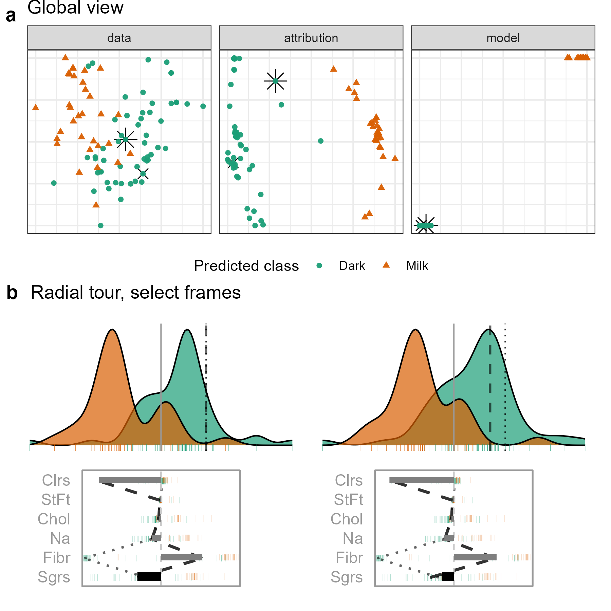

```{r include=FALSE, cache=FALSE}
## Compilation dependencies
library("knitr")
library("kableExtra")
library("magrittr")

## chunk options
knitr::opts_chunk$set(
  fig.align  = "center",
  echo       = FALSE,
  collapse   = TRUE,
  message    = FALSE,
  warning    = FALSE,
  error      = FALSE,
  cache      = FALSE,
  cache.lazy = FALSE,
  fig.height = 5,
  fig.width = 8,
  out.width = "100%"
)
```
<!-- bookdown::pdf_document2: allows \@ref(), pdf_document: requires \ref{} -->
<!-- # cheat sheet {#sec:cheatsheet} -->
<!-- A bib reference [@wickham_visualizing_2015]. -->
<!-- A [Section intro](#sec:cheatsheet) reference, alternatively, section \@ref(sec:intro) (with @; \\@ref(sec:intro)). -->
<!-- ```{r crest, echo=FALSE, out.height = "10%", out.width = "10%", fig.cap = "A caption for crest figure"} -->
<!-- knitr::include_graphics("./figures/crest.jpg") -->
<!-- ``` -->
<!-- A figure \@ref(fig:crest) reference (with @; \\@ref(fig:crest). -->
<!-- (ref:baseplotcap) Separate caption created above the __R__ chunk -->
<!-- ```{r baseplot, echo=F, fig.cap = "(ref:baseplotcap)"} -->
<!-- plot(1,2) -->
<!-- ``` -->

# Introduction {#sec:intro}

<!-- Introduce explanatory vs predictive modeling -->
There are different reasons and purposes for fitting a model. According to the taxonomies of @breiman_statistical_2001 and @shmueli_explain_2010, it can be useful to group models into two types: explanatory and predictive. Explanatory modeling is used for inferential purposes, while predictive modeling focuses solely on the performance of an objective function. The intended use of the model has important implications for its selection and development. Interpretability is critical in explanatory modeling to draw meaningful inferential conclusions, such as which variables most contribute to a prediction or whether some observations are less well fit. Interpretability becomes more difficult when the model is nonlinear. Nonlinear models occur in statistical models with polynomial or interaction terms between quantitative predictors, and almost all computational models such as random forests, support-vector machines, or neural networks [e.g. @breiman_random_2001; @boser_training_1992; @anderson_introduction_1995].

<!-- nonlinear leading to interpretability issues -->
In linear models interpretation of the importance of variables is relatively straight forward, one adjusts for the covariance of multiple variables when examining the relationship with the response. The interpretation is valid for the full domain of the predictors. In nonlinear models one needs to consider the model in small neighbourhoods of the domain to make any assessment of variable importance. Even though this is difficult, it is especially important to interpret model fits as we become more dependent on nonlinear models for routine aspects of life to avoid issues decribed in @stahl-ethics. Understanding how nonlinear models behave when usage extrapolates outside the domain of predictors, either in subspaces where few samples were provided in the training set, or extending outside the domain. It is especially important because nonlinear models can vary wildly and predictions can be dramatically wrong in these areas.

<!-- Interpretability & baises 
Interpretability is vital for exploring and protecting against potential biases in any model, e.g., sex\-\-\-@dastin_amazon_2018; @duffy_apple_2019, race\-\-\-@larson_how_2016, and age\-\-\-@diaz_addressing_2018. For observation, models regularly pick up on biases in the training data where such classes correlate with changes in the response variable. This bias is then built into the model. Variable-level interpretability of models is essential in evaluating and addressing such biases.
-->

<!-- Interpretability & data drift 
Another concern is data drift, where a shift in the range of the explanatory variables (features or predictors) between training and test sets. Some nonlinear models are sensitive to this and do not extrapolate well outside the support of the training data [@espadoto_toward_2021]. Maintaining variable interpretability is also essential to address issues arising from data drift.
-->

<!-- Local explanations -->
Explainable Artificial Intelligence (XAI) is an emerging field of research focused on methods for the interpreting of models [@adadi_peeking_2018; @arrieta_explainable_2020]. A class of techniques called _local explanations_, provide methods to approximate linear variable importance at the location of each observation or the predictions at a specific point in the data domain. Because these are point-specific, it is challenging to comprehensively visualize them to understand a model. There are common approaches for visualising high-dimensional data as a whole, but what is needed are new approaches for viewing these individual local explanations, in relation to the whole.

<!-- Data visualization tours -->
For multivariate data visualization, a _tour_ [@asimov_grand_1985; @buja_grand_1986; @lee_state_2021] of linear data projections onto a lower-dimensional space, could be an element of XAI, complementing local explanations. <!--Tours are viewed as an animation over minor changes to the projection basis. Structure in a projection can then be explored visually to see which variables contribute to the formation of that structure. The intuition is similar to watching the shadow of a hidden 3D object change as the object is rotated; watching the shape of the shadow change conveys information about the structure and variables of the object.-->
<!-- tours and models -->
Applying tours to model interpretation is recommended in @wickham_visualizing_2015 primarily to examine the fitted model in the space of the data. @cook_interactive_2007 describe the use of tours for exploring classification boundaries and model diagnostics [@Caragea2008; @lee_pptree_2013; @da_silva_projection_2021].
<!-- Manual tours --> 
There are various types of tours. In a _manual_ or radial tour [@cook_manual_1997; @spyrison_spinifex_2020], the path of linear projections is defined by changing the contribution of a selected variable. We propose to use this to scrutinize a local explanation. <!-- Additional interactive elements in a graphical user interface should allow the user to identify an observation of interest and then explore its local explanation by changing variable contribution with the radial tour. -->
<!-- What-if & counterfactual analysis -->
This approach could be considered to be a counterfactual, what-if analysis, such as _ceteris paribus_ ("other things held constant") profiles [@biecek_ceterisparibus_2020]. <!-- These profiles show how an observation's prediction would change from a marginal change in one explanatory variable, given that other variables are held constant. It ignores correlations of the variables and imagines a case that was not observed. In contrast, our approach is a geometric explanation of the factual; it varies contributions of the variables by rotating the basis, a reorientation of the data object. A constraint in our approach is that the basis must remain orthonormal. When the contribution of one variable decreases, the contributions of others necessarily increase such that there is a complete component in that direction. This also ensures that what is seen is strictly a low-dimensional projection from high-dimensional space and is thus an interpretable visualization.-->

<!-- Paper structure -->
The remainder of this paper is organized as follows. Section \ref{sec:explanations} covers the background of the local explanation and the traditional visuals produced. Section \ref{sec:tour} explains the tours and particularly the radial manual tour. Section \ref{sec:cheemviewer} discusses the visual layout in the graphical user interface and how it facilitates analysis, data pre-processing, and package infrastructure. Illustrations are provided in Section \ref{sec:casestudies} for a range of supervised learning tasks with categorical and quantitative response variables. These show how the local explanations can be used to get an overview of the model's use of predictors, and to investigate errors in the model predictions. Section \ref{sec:cheemdiscussion} concludes with a summary of the insights gained. The methods are implemented in the __R__ package __cheem__. 


# Local Explanations {#sec:explanations}

<!-- Reminder of local explanation -->
Consider a highly nonlinear model. It can be hard to determine whether small changes in a variable's value will make a class prediction change group or identify which variables contribute to an extreme residual. Local explanations shed light on these situations by estimate linear variable importance in the vicinity of a single observation. There are many approaches for calculating local explanations.

<!-- Taxonomy of local explanations -->
A comprehensive summary of the taxonomy of currently available methods is provided in Figure 6 by @arrieta_explainable_2020. It includes a large number of model-specific explanations such as deepLIFT [@shrikumar_not_2016; @shrikumar_learning_2017], a popular recursive method for estimating importance in neural networks. There are fewer model-agnostic methods, of which LIME, [@ribeiro_why_2016] SHaply Additive exPlanations (SHAP), [@lundberg_unified_2017], are popular. 

<!-- Uses of local explanations -->
These observation-level explanations are used in various ways depending on the data. In image classification, where pixels correspond to predictors, saliency maps overlay or offset a heatmap to indicate important pixels [@simonyan_deep_2014]. For example, pixels corresponding to snow may be highlighted as important contributors when distinguishing if a picture contains a coyote or husky. In text analysis, word-level contextual sentiment analysis highlights the sentiment and magnitude of influential words [@vanni_textual_2018]. In the case of numeric regression, they are used to explain additive contributions of variables from the model intercept to the observation's prediction [@ribeiro_why_2016].

<!-- SHAP -->
We will be focusing on SHAP values in this this paper, but the approach is applicable for any methods of calculating the local explanations. SHAP calculates the variable contributions of one observation by examining the effect of other variables on the predictions. The SHAP explanation refers to @shapley_value_1953's method to evaluate an individual's contribution in cooperative games by assessing this player's performance in the presence or absence of other players. @strumbelj_efficient_2010 introduced SHAP for local explanations in machine learning models. The attribution of variable importance depends on the sequence being the included variables. The SHAP value for an observation are the average contributions of each variable, computed for different sequences, or permutations, of the variables. The approach is related to partial dependence plots (see for example @molnar_interpretable_2020), used to explain the effect of a variable by predicting the response for a range of values on this variable after fixing the value of all other variables to their mean. Though partial dependence plots are a global approximation of the variable importance, while SHAP is specific to one observation. It could also be considered similar to examining the coefficients from all subsets regression, as described in @wickham_visualizing_2015 which help to understand the relative importance of each variable in the context of all other candidate variables.

```{r shapdistrbd, echo=F, fig.align='center', out.width="85%", fig.cap = "Illustration of SHAP values for a random forest model FIFA 2020 player wages from nine skill predictors. A star offensive and defensive player are compared, L. Messi and V. van Dijk, respectively. Panel (a) shows breakdown plots of three sequences of the variables. The sequence of the variables impacts the magnitude of their attribution. Panel (b) shows the distribution of attribution for each variable across 25 sequences of predictors, with the mean displayed as a dot for each player. Reaction skills are important for both players. Offense and movement are important for Messi but not van Dijk, and conversely, defense and power are important for van Dijk but not Messi."}
knitr::include_graphics("./figures/shap_distr_bd.png")
```

<!-- Fifa example -->
We use 2020 season FIFA data [@leone_fifa_2020] to illustrate SHAP following the procedures described in @biecek_explanatory_2021. There are 5000 observations of nine predictor variables measuring players' skills and one response variable, wages (in euros). A random forest model is fit regressing players' wages on the skill variables. In this illustration in Figure \ref{fig:shapdistrbd} the SHAP values are compared for a star offensive player (L. Messi) and a prominent defensive player (V. van Dijk). What we are interested to know is how the skill variables locally contribute to the wage prediction of each player. A difference in the attribution of the variable importance across the two positions of the players can be expected. This would be interpreted as how a player's salary depends on which combination of skills. Panel (a) is a version of a breakdown plot [@gosiewska_ibreakdown_2019] where just three sequences of variables are shown. Here we can see how the variable contribution can change depending on sequence, relative to both players. (Note that the order of the variables is different in each plot, because they have been sorted by biggest average contribution across both players.) For all sequences, and for both players `reaction` has the strongest contribution, with perhaps more importance for the defensive player. Then it differs by player: for Messi `offense` and `movement` have the strongest contributions, and for van Dijk it is `defense` and `power`, regardless of the variable sequence.

Panel (b) shows the differences in the player's median values (large dots) for 25 such sequences (tick marks).  We can see that the wage predictions for the two players come from different combinations of skills sets, as might be expected for players who's value on the team depends on their offensive or defensive prowess. It is also interesting to see from the distribution of values across the different sequence of variables, that there is some multimodality. For example, look at the SAHP values for `reaction` for Messi, and in some sequences reaction has a much lower contribution than others. This suggests that other variables (`offense`, `movement` probably) can substitute for `reaction` in the wage prediction.

In summary, these plots highlight how local explanations bring interpretability to a model, at least in the vicinity of their observations. In this observation, two players with different positions receive different profiles of variable importance to explain the prediction of their wages.

<!-- tree SHAP -->
For the application, we use _tree SHAP_, a variant of SHAP that enjoys a lower computational complexity [@lundberg_consistent_2018]. Instead of aggregating over sequences of the variables, tree SHAP calculates observation-level variable importance by exploring the structure of the decision trees. Tree SHAP is only compatible with tree-based models. so random forests are used for illustration. <!--The following section will use normalized SHAP values as a projection basis (call this the _attribution projection_) that will be used to explore the sensitivity of the variable contributions.-->


# Tours and the Radial Tour {#sec:tour}

<!-- Tours intro -->
A _tour_ enables the  viewing of high-dimensional data by animating many linear projections with small incremental changes. It is achieved by following a path of linear projections (bases) of high-dimensional space. One key variable of the tour is the object permanence of the data points; one can track the relative change of observations in time and gain information about the relationships between points across multiple variables. There are various types of tours that are distinguished by how the paths are generated [@lee_state_2021; @cook_grand_2008].

<!-- Manual tour -->
The manual tour [@cook_manual_1997] defines its path by changing a selected variable's contribution to a basis to allow the variable to contribute more or less to the projection. The requirement constrains the contribution of all other variables that a basis needs to be orthonormal (column correspond to vectors, with unit length, and orthogonal to each other). The manual tour is primarily used to assess the importance of a variable to structure visible in a projection. It also lends itself to pre-computation queued in advance or computed on-the-fly for human-in-the-loop analysis [@karwowski_international_2006]. 

<!-- Radial tour -->
A version of the manual tour called a _radial tour_ is implemented in @spyrison_spinifex_2020 and forms the basis of the new work. In a radial tour, the selected variable can change its magnitude of contribution but not its angle; it must move along the direction of its original contribution. The implementation allows for pre-computation and interactive re-calculation to focus on a different variable.

# Shapley's Lenses {#sec:shapleylenses}

Shapley values are a useful technique for understanding the nature of the relationship between the input variables and the target variable. The data exploration process is navigated by a trained predictive model. 

Thus, local attributions can be viewed as a new representation of data (commonly referred as data embeddings by machine learning community) with certain desired properties, e.g., the unit is standardized between variables because it reflects the relation with target variable, so it is expressed on the scale of the target variable.

But different models can produce different local attributions. This phenomenon, known as the multiplicity of good models or as the Rashomon set of equally good models, means that models that fit the data equally well can describe the relationships present in the data in different ways. 

The response to the challenge in the characterization of Rashomon sets may be Shapley's Lenses - the opportunity to compare these models from the perspective of exploring the local attributions generated by the Shapley values for different models. 


# The Cheem Viewer {#sec:cheemviewer}

To explore the local explanations, coordinated views [@roberts_state_2007] [also known as ensemble graphics, @unwin_ensemble_2018] are provided in the _cheem viewer_ application. There are two primary plots: the __global view__ to give the context of all of the SHAP values and the __radial tour view__ to explore the local explanations with user-controlled rotation. There are numerous user inputs, including variable selection for the radial tour and observation selection for making comparisons. There are different plots used for the categorical and quantitative responses. Figures \ref{fig:classificationcase} and \ref{fig:regressioncase} are screenshots showing the cheem viewer for the two primary tasks: classification (categorical response) and regression (quantitative response).


## Global View

<!-- Purpose -->
The global view provides context for all observations and facilitates the exploration of the separability of the data- and attribution-spaces. These spaces both have dimensionality $n \times p$, where $n$ is the number of observations and $p$ is the number of variables. The attribution space corresponds to the local explanations for each observation; variable importance in the vicinity of the observation.

<!-- Approximations of the spaces, PC1:2 -->
The visualization is composed of the first two principal components of the data (left) and the attribution (middle) spaces. These single 2D projections will not reveal all of the structure of higher-dimensional space, but they are helpful visual summaries. In addition, a plot of the observed against predicted response values is also provided (Figures \ref{fig:classificationcase}b, \ref{fig:regressioncase}a) to help identify observations poorly predicted by the model. <!-- Interactions --> For classification tasks, misclassified observations are circled in red. Linked brushing between the plots is provided, and a tabular display of selected points helps to facilitate exploration of the spaces and the model (shown in Figures \ref{fig:regressioncase}d).

While the comparison of these spaces is interesting, the primary purpose of the global view is to enable the selection of particular observations to explore in detail. The projection attribution of the primary observation (PI) is examined and typically viewed with an optional comparison observation (CI). These observations are highlighted as asterisk and $\times$, respectively.


## Radial Tour

<!-- Local explanations as par coords -->
The local explanations for all observations are normalized (sum of squares equals 1), and thus, the relative importance of variables can be compared across all observations. These are depicted as vertical parallel coordinate plots [@ocagne_coordonnees_1885] on the basis biplot [@gabriel_biplot_1971]. 1D biplot displays the values of the current basis as bars. The parallel coordinate overlays lines connecting one observation's variable attribution (Figures \ref{fig:classificationcase}e and \ref{fig:regressioncase}e). The attribution projections of the PI and CI are shown as dashed and dotted lines. From this plot, the range and density of the importance across all observations can be interpreted. For classification, one would look at differences between groups on any variable. For example, Figure \ref{fig:classificationcase}e suggests that `bl` is important for distinguishing the green class from the other two. For regression, one might generally observe which variables have low values for all observations (not important). For example, `BMI` and `pwr` in Figure \ref{fig:regressioncase}e, have a range of high and low values (e.g., `off`, `def`), suggesting they are important for some observations and not important for others.

<!-- Segue of PI to attribution projection -->
The overlaid bars on the parallel coordinate plot represent the attribution projection of the PI. (Remember that the PI is interactively selected from the global view). The attribution projection approximates the variable importance for predicting this observation. The combination of variables best explains the difference between the mean response and an observation’s predicted value. It is not an indication of the local shape of the model surface. That is, it is not some indication of the tangent to the curve at this point.

<!-- Tour animation -->
The attribution projection of the PI is the initial 1D basis in a radial tour, displayed as a density plot for a categorical response (Figure \ref{fig:classificationcase}f) and as scatterplots for a quantitative response (Figure \ref{fig:regressioncase}f). The PI and CI are indicated by vertical dashed and dotted lines. The radial tour varies the contribution of the selected variable between 0 and 1. This is viewed as an animation of the projections from many intermediate bases. Doing so tests the sensitivity of structure (class separation or strength of relationship) to the variable's contribution. For classification, if the separation between classes diminishes when the variable contribution is reduced, this suggests that the variable is important for class separation. For regression, if the relationship scatterplot weakens when the variable contribution is reduced, indicating that the variable is important for accurately predicting the response.


## Classification Task

Selecting a misclassified observation as PI and a correctly classified point nearby in data space as CI makes it easier to examine the variables most responsible for the error. The global view (Figure \ref{fig:classificationcase}c) displays the model confusion matrix. The radial tour is 1D and displays as density where color indicates class. An animation slider enables users to vary the contribution of variables to explore the sensitivity of the separation to that variable.

```{r classificationcase, echo=F, out.width = "100%", fig.align="center", fig.cap = "Overview of the cheem viewer for classification tasks (categorical response). Global view inputs, (a), set the PI, CI, and color statistic. Global view, (b) PC1 by PC2 approximations of the data- and attribution-space. (c) prediction by observed $y$ (visual of the confusion matrix for classification tasks). Points are colored by predicted class, and red circles indicate misclassified observations. Radial tour inputs (d) select variables to include and which variable is changed in the tour. (e) shows a parallel coordinate display of the distribution of the variable attributions while bars depict contribution for the current basis. The black bar is the variable being changed in the radial tour. Panel (f) is the resulting data projection indicated as density in the classification case."}
knitr::include_graphics("./figures/app_classification.PNG")
```


## Regression Task

Selecting an inaccurately predicted observation as PI and an accurately predicted observation with similar variable values as CI is a helpful way to understand how the model is failing or not. The global view (Figure \ref{fig:regressioncase}a) shows a scatterplot of the observed vs predicted values, which should exhibit a strong relationship if the model is a good fit. The points can be colored by a statistic, residual, a measure of outlyingness (log Mahalanobis distance), or correlation to aid in understanding the structure identified in these spaces.

In the radial tour view, the observed response and the residuals (vertical) are plotted against the attribution projection of the PI (horizontal). The attribution projection can be interpreted similarly to the predicted value from the global view plot. It represents a linear combination of the variables, and a good fit would be indicated when there is a strong relationship with the observed values. This can be viewed as a local linear approximation if the fitted model is nonlinear. As the contribution of a variable is varied, if the value of the PI does not change much, it would indicate that the prediction for this observation is NOT sensitive to that variable. Conversely, if the predicted value varies substantially, the prediction is very sensitive to that variable, suggesting that the variable is very important for the PI's prediction.

```{r regressioncase, echo=F, out.width="100%", fig.cap="Overview of the cheem viewer for regression tasks (quantitative response) and illustration of interactive variables. Panel (a) PCA of the data- and attributions- spaces and the (b) residual plot, predictions by observed values. Four selected points are highlighted in the PC spaces and tabularly displayed. Coloring on a statistic (c) highlights structure organized in the attribution space. Interactive tabular display (d) populates when observations are selected. Contribution of the 1D basis affecting the horizontal position (e) parallel coordinate display of the variable attribution from all observations, and horizontal bars show the contribution to the current basis. Regression projection (f) uses the same horizontal projection and fixes the vertical positions to the observed $y$ and residuals (middle and right)."}
knitr::include_graphics("./figures/app_regression_interactions.PNG")
```


## Interactive variables

<!-- Reactive vs exploration interactions -->
The application has several reactive inputs that affect the data used, aesthetic display, and tour manipulation. These reactive inputs make the software flexible and extensible (Figure \ref{fig:classificationcase}a & d). The application also has more exploratory interactions to help link points across displays, reveal structures found in different spaces, and access the original data.

<!-- Exploratory interactions -->
A tooltip displays observation number/name and classification information while the cursor hovers over a point. Linked brushing allows the selection of points (left click and drag) where those points will be highlighted across plots (Figure \ref{fig:classificationcase}a & b). The information corresponding to the selected points is populated on a dynamic table (Figure \ref{fig:classificationcase}d). These interactions aid exploration of the spaces and, finally, the identification of primary and comparison observations.


## Preprocessing

It is vital to mitigate the render time of visuals, especially when users may want to iterate many explorations. All computational operations should be prepared before runtime. The work remaining when an application is run solely reacts to inputs and rendering visuals and tables. Below discusses the steps and details of the reprocessing. 

<!-- Switch to rmd bullets, consistent with thesis -->
- __Data:__ predictors and response are unscaled complete numerical matrix. Most models and local explanations are scale-invariant. Keep normality assumptions of the model in mind. 
- __Model:__ any model and compatible explanation could be explored with this method. Currently, random forest models are applied via the package __randomForest__ [@liaw_classification_2002], compatibility tree SHAP. Modest hyperparameters are used, namely: 125 trees, the number of variables at each split, mtry = $\sqrt{p}$ or $p/3$ for classification and regression, and minimum size of terminal nodes $max(1, n/500)$ or $max(5, n/500)$ for classification and regression.
- __Local explanation:__ Tree SHAP is calculated for _each_ observation using the package __treeshap__ [@kominsarczyk_treeshap_2021]. We opt to find the attribution of each observation in the training data and not fit to fit variable interactions.
- __Cheem viewer:__ after the model and full explanation space are calculated, each variable is scaled by standard deviations away from the mean to achieve common support for visuals. Statistics for mapping to color are computed on the scaled spaces.

<!-- Note on time of execution -->
The time to preprocess the data will vary significantly with the complexity of the model and local explanation. For reference, the FIFA data contained 5000 observations of nine explanatory variables took 2.5 seconds to fit a random forest model of modest hyperparameters. Extracting the tree SHAP values of each observation took 270 seconds total. PCA and statistics of the variables and attributions took 2.8 seconds. These runtimes were from a non-parallelized session on a modern laptop, but suffice to say that most of the time will be spent on the local attribution. An increase in model complexity or data dimensionality will quickly become an obstacle. Its reduced computational complexity makes tree SHAP an excellent candidate to start. [Alternatively, the package __fastshap__ claims extremely low runtimes, attributed to fewer calls to the prediction function, partial implementation in C++, and efficient use of logical subsetting, @greenwell_fastshap_2020.]


## Package Infrastructure {#sec:infrastructure}

The above-described method and application are implemented as an open-source __R__ package, __cheem__ available on CRAN at \url{https://CRAN.R-project.org/package=cheem}. Preprocessing was facilitated with models created via __randomForest__ [@liaw_classification_2002] and explanations calculated with __treeshap__ [@kominsarczyk_treeshap_2021]. The application was made with __shiny__ [@chang_shiny_2021]. The tour visual is built with __spinifex__ [@spyrison_spinifex_2020]. Both views are created first with __ggplot2__ [@wickham_ggplot2_2016] and then rendered as interactive `html` widgets with __plotly__ [@sievert_interactive_2020]. __DALEX__ [@biecek_dalex_2018] and the free ebook, _Explanatory Model Analysis_ [@biecek_explanatory_2021] were a boon to understanding local explanations and how to apply them.


## Installation and Getting Started

The package can be installed from CRAN, and the application can be run using the following __R__ code:

```{r eval=FALSE, echo=TRUE}
install.packages("cheem", dependencies = TRUE)
library("cheem")
run_app()
```

Alternatively,

- A version of the cheem viewer shiny app can be directly accessed at
\url{https://ebsmonash.shinyapps.io/cheem_initial/}.
- The development version of the package is available at \url{https://github.com/nspyrison/cheem}, and
- Documentation of the package can be found at \url{https://nspyrison.github.io/cheem/}.

Follow the examples provided with the package to compute the local explanation (using `?cheem_ls`). The application expects the output returned by `cheem_ls()`, saved to an `rds` file with `saveRDS()` to be uploaded.


# Case Studies {#sec:casestudies}

To illustrate the cheem method it is applied to modern data sets, two classification examples and then two of regression.


## Palmer Penguin, Species Classification

The Palmer penguins data [@gorman_ecological_2014; @horst_palmerpenguins_2020] was collected on three species of penguins foraging near Palmer Station, Antarctica. The data is publicly available to substitute for the overly-used iris data and is quite similar in form. After removing incomplete observations, there are 333 observations of four physical measurements, bill length (`bl`), bill depth (`bd`), flipper length (`fl`), and body mass (`bm`) for this illustration. A random forest model was fit with species as the response variable.

(ref:casepenguins-cap) Examining the SHAP values for a random forest model classifying Palmer penguin species. The PI is a Gentoo (purple) penguin that is misclassified as a Chinstrap (orange), marked as an asterisk in (a) and the dashed vertical line in (b). The radial view shows varying the contribution of `fl` from the initial attribution projection (b, left), which produces a linear combination where the PI is more probably (higher density value) a Chinstrap than a Gentoo (b, right). (The animation of the radial tour is at \url{https://vimeo.com/666431172}.)
```{r casepenguins, echo=F, out.width="100%", fig.cap = "(ref:casepenguins-cap)"}
knitr::include_graphics("./figures/case_penguins.png")
```

Figure \ref{fig:casepenguins} shows plots from the cheem viewer for exploring the random forest model on the penguins data. Panel (a) shows the global view, and panel (b) shows several 1D projections generated with the radial tour. Penguin 243, a Gentoo (purple), is the PI because it has been misclassified as a Chinstrap (orange).

(ref:casepenguinsblfl-cap) Checking what is learned from the cheem viewer. This is a plot of flipper length (`fl`) and bill length (`bl`), where an asterisk highlights the PI. A Gentoo (purple) misclassified as a Chinstrap (orange). The PI has an unusually small `fl` length which is why it is confused with a Chinstrap.
```{r casepenguinsblfl, echo=F, out.width="100%", fig.cap = "(ref:casepenguinsblfl-cap)"}
knitr::include_graphics("./figures/case_penguins_BlFl.png")
```

There is more separation visible in the attribution space than in the data space, as would be expected. The predicted vs observed plot reveals a handful of misclassified observations. A Gentoo that has been wrongly labeled as a Chinstrap is selected for illustration. The PI is a misclassified point (represented by the asterisk in the global view and a dashed vertical line in the tour view). The CI is a correctly classified point (represented by an $\times$ and a vertical dotted line).

The radial tour starts from the attribution projection of the misclassified observation (b, left). The important variables identified by SHAP in the (wrong) prediction for this observation are mostly `bl` and `bd` with small contributions of `fl` and `bm`. This projection is a view where the Gentoo (purple) looks much more likely for this observation than Chinstrap. That is, this combination of variables is not particularly useful because the PI looks very much like other Gentoo penguins. The radial tour is used to vary the contribution of flipper length (`fl`) to explore this. (In our exploration, this was the third variable explored. It is typically helpful to explore the variables with more significant contributions, here `bl` and `bd`. Still, when doing this, nothing was revealed about how the PI differed from other Gentoos). On varying `fl` as it contributes increasingly to the projection (b, right), more and more, this penguin looks like a Chinstrap. This suggests that `fl` should be considered an important variable for explaining the (wrong) prediction.

Figure \ref{fig:casepenguinsblfl} confirms that flipper length (`fl`) is vital for the confusion of the PI as a Chinstrap. Here, flipper length and body length are plotted, and the PI can be seen to be closer to the Chinstrap group in these two variables, mainly because it has an unusually low value of flipper length relative to other Gentoos. From this view, it makes sense that it is a hard observation to account for, as decision trees can only partition only vertical and horizontal lines.


## Chocolates, Milk/Dark Classification

<!-- Data description -->
The chocolates data set consists of 88 observations of ten nutritional measurements determined from their labels and labeled as either milk or dark. Dark chocolate is considered healthier than milk. Students collected the data during the Iowa State University class STAT503 from nutritional information on the manufacturer's websites and were normalized to 100g equivalents. The data is available in the __cheem__ package. A random forest model is used for the classification of chocolate types.

<!-- Dark misclassified as milk, rational -->
It could be interesting to examine the nutritional properties of any dark chocolates that have been misclassified as milk. A reason to do this is that a dark chocolate, nutritionally more like milk should not be considered a healthy alternative. It is interesting to explore which nutritional variables contribute most to misclassification.

(ref:casechocolates-cap) Examining the local explanation for a PI which is dark (orange) chocolate incorrectly predicted to be milk (green). From the attribution projection, this chocolate correctly looks more like dark than milk, which suggests that the local explanation does not help understand the prediction for this observation. So, the contribution of Sugar is varied---reducing it corresponds primarily with an increased magnitude from Fiber. When Sugar is zero, Fiber contributes strongly towards the left. In this view, the PI is closer to the bulk of the milk chocolates, suggesting that the prediction put a lot of importance on Fiber. This chocolate is a rare dark chocolate without any Fiber leading to it being mistaken for a milk chocolate. (A video of the tour animation can be found at \url{https://vimeo.com/666431143}.)
```{r casechocolates, echo=F, out.width="100%", fig.cap = "(ref:casechocolates-cap)"}
knitr::include_graphics("./figures/case_chocolates.png")
```

<!-- Dark misclassified as milk, description -->
This type of exploration is shown in Figure \ref{fig:casechocolates}, where a chocolate labeled dark but predicted to be milk is chosen as the PI (observation 22). It is compared with a CI that is a correctly classified dark chocolate (observation 7). The PCA plot and the tree SHAP PCA plots (a) show a big difference between the two chocolate types but with confusion for a handful of observations. The misclassifications are more apparent in the observed vs predicted plot and can be seen to be mistaken in both ways: milk to dark and dark to milk.

<!-- Dark misclassified as milk,  -->
The attribution projection for chocolate 22 suggests that Fiber, Sugars, and Calories are most responsible for its incorrect prediction. The way to read this plot is to see that Fiber has a large negative value while Sugars and Calories have reasonably large positive values. In the density plot, observations on the very left of the display would have high values of Fiber (matching the negative projection coefficient) and low values of Sugars and Calories. The opposite would be interpreting a point with high values in this plot. The dark chocolates (orange) are primarily on the left, and this is a reason why they are considered to be healthier: high fiber and low sugar. The density of milk chocolates is further to the right, indicating that they generally have low fiber and high sugar.

<!-- Attention to PCP -->
The PI (dashed line) can be viewed against the CI (dotted line). Now, one needs to pay attention to the parallel plot of the SHAP values, which are local to a particular observation, and the density plot, which is the same projection of all observations as specified by the SHAP values of the PI. The variable contribution of the two different predictions can be quickly compared in the parallel coordinate plot. The PI differs from the comparison primarily on the Fiber variable, which suggests that this is the reason for the incorrect prediction.

<!-- Attention to Density, end of first case -->
From the density plot, which is the attribution projection corresponding to the PI, both observations are more like dark chocolates. Varying the contribution of Sugars and altogether removing it from the projection is where the difference becomes apparent. When a frame with contribution primarily from Fiber is examined observation 22 looks more like a milk chocolate.

<!-- segue and selection for chocolates inverse case -->
It would also be interesting to explore an inverse misclassification. In this case, a milk chocolate is selected while it was misclassified as a dark chocolate. Chocolate 84 is just this case and is compared with a correctly predicted milk chocolate (observation 71). The corresponding global view and radial tour frames are shown in Figure \ref{fig:casechocolatesinverse}.

(ref:casechocolatesinverse-cap) Examining the local explanation for a PI which is milk (green) chocolate incorrectly predicted to be dark (orange). In the attribution projection, the PI could be either milk or dark. Sodium and Fiber have the largest differences in attributed variable importance, with low values relative to other milk chocolates. The lack of importance attributed to these variables is suspected of contributing to the mistake, so the contribution of Sodium is varied. If Sodium had a larger contribution to the prediction (like in this view). the PI would look more like other milk chocolates. (A video of the tour animation can be found at \url{https://vimeo.com/666431148}.)
```{r casechocolatesinverse, echo=F, out.width="100%", fig.cap = "(ref:casechocolatesinverse-cap)"}

```

<!-- treeSHAP pca, for inverse case -->
The difference of position in the tree SHAP PCA with the previous case is quite significant; this gives a higher-level sense that the attributions should be quite different. Looking at the attribution projection, this is found to be the case. Previously, Fiber was essential while it is absent from the attribution in this case. Conversely, Calories from Fat and Total Fat have high attributions here, while they were unimportant in the preceding case.

<!-- PCP, for inverse case -->
Comparing the attribution with the CI (dotted line), large discrepancies in Sodium and Fiber are identified. The contribution of Sodium is selected to be varied. Even in the initial projection, the observation looks slightly more like its observed milk than predicted dark chocolate. The misclassification appears least supported when the basis reaches sodium attribution of typical dark chocolate.


## FIFA, Wage Regression

<!-- Data description -->
The 2020 season FIFA data [@leone_fifa_2020; @biecek_dalex_2018] contains many skill measurements of soccer/football players and wage information. Nine higher-level skill groupings were identified and aggregated from highly correlated variables. A random forest model is fit from these predictors, regressing player wages [2020 euros]. The model was fit from 5000 observations before being thinned to 500 players to mitigate occlusion and render time. Continuing from the exploration in Section \ref{sec:explanations), we are interested to see the difference in attribution based on the exogenous player position. That is, the model should be able to use multiple linear profiles to better predict the wages from different field positions of players despite not having this information. A leading offensive fielder (L. Messi) is compared with a top defensive fielder (V. van Dijk). The same observations were used in Figure \ref{fig:shapdistrbd}.

(ref:casefifa-cap) Exploring the wages relative to skill measurements in the FIFA 2020 data. Star offensive player (L. Messi) is the PI, and he is compared with a top defensive player (V. van Dijk). The attribution projection is shown on the left, and it can be seen that this combination of variables produces a view where Messi has very high predicted (and observed) wages. Defense (`def`) is the chosen variable to vary. It starts very low, and Messi's predicted wages decrease dramatically as its contribution increases (right plot). The increased contribution in defense comes at the expense of offensive and reaction skills. The interpretation is that Messi's high wages are most attributable to his offensive and reaction skills, as initially provided by the local explanation. (A video of the animated radial tour can be found at \url{https://vimeo.com/666431163}.)
```{r casefifa, echo=F, out.width = "90%", fig.cap = "(ref:casefifa-cap)"}
knitr::include_graphics("./figures/case_fifa.png")
```

Figure \ref{fig:casefifa} tests the support of the local explanation. Offensive and reaction skills (`off` and `rct`) are both crucial to explaining a star offensive player. If either of them were rotated out, the other would be rotated into the frame, maintaining a far-right position. However, increasing the contribution of a variable with low importance would rotate both variables out of the frame.

The contribution from `def` will be varied to contrast with offensive skills. As the contribution of defensive skills increases, Messi's is no longer separated from the group. Players with high values in defensive skills are now the rightmost points. In terms of what-if analysis, the difference between the data mean and his predicted wages would be halved if Messi's tree SHAP attributions were at these levels.

(ref:caseames-cap) Exploring an observation with an extreme residual as the PI in relation to an observation with an accurate prediction for a similarly priced house in a random forest fit to the Ames housing data. The local explanation indicates a sizable attribution to Lot Area (`LtA`), while the CI has minimal attribution to this variable. The PI has a higher predicted value than the CI in the attribution projection. Reducing the contribution of Lot Area brings these two prices in line. This suggests that if the model did not value Lot Area so highly for this observation, then the observed sales price would be quite similar. That is, the large residual is due to a lack of factoring in the Lot Area for the prediction of PI's sales price. (A video showing the animation is at \url{https://vimeo.com/666431134}.)
```{r caseames, echo=F, out.width="90%", fig.cap = "(ref:caseames-cap)"}
knitr::include_graphics("./figures/case_ames2018.png")
```

## Ames Housing 2018, Sales Price Regression

Ames housing data 2018 [@de_cock_ames_2011; @prevek18_ames_2018] was subset to North Ames (the neighborhood with the most house sales). The remaining are 338 house sales. A random forest model was fit, predicting the sale price [USD] from the property variables: Lot Area (`LtA`), Overall Quality (`Qlt`), Year the house was Built (`YrB`), Living Area (`LvA`), number of Bathrooms (`Bth`), number of Bedrooms (`Bdr`), the total number of Rooms (`Rms`), Year the Garage was Built (`GYB`), and Garage Area (`GrA`). Using  interactions with the global view, a house with an extreme negative residual and an accurate observation with a similar prediction is selected.

Figure \ref{fig:caseames} selects the house sale 74, a sizable under prediction with an enormous Lot Area contribution. The CI has a similar predicted price though the prediction was accurate and gives almost no attribution to lot size. The attribution projection places observations with high Living Areas to the right. The contribution of Living Area contrasts the contribution of this variable. As the contribution of Lot Area decreases, the predictive power decreases for the PI, while the CI remains stationary. This large importance in the Living Area is relatively uncommon. Boosting tree models may be more resilient to such an under-prediction as they would up-weighting this residual and force its inclusion in the final model.


# Discussion {#sec:cheemdiscussion}

There is a clear need to extend the interpretability of black box models. This paper provides a technique that builds on local explanations to explore the variable importance local to an observation. The local explanations of an attribution projection from which variable contributions are varied using a radial tour. Several diagnostic plots are provided to assist with understanding the sensitivity of the prediction to particular variables. A global view shows the data space, explanation space, and residual plot. The user can interactively select observations to compare, contrast, and study further. Then the radial tour is used to explore the variable sensitivity identified by the attribution projection.

This approach has been illustrated using four data examples of random forest models with the tree SHAP local explanation. Local explanations focus on the model fit, and help to dissect which variables are most responsible for the fitted value. They can also form the basis of learning how the model has got it wrong, with when the observation is misclassified or has a large residual.

In the penguins example, we showed how the misclassification of a penguin arose due to it having an unusually small flipper size compared to others of its species. This was verified by making a follow-up plot of the data. The chocolates example shows how a dark chocolate was misclassified primarily due to its attribution to Fiber, and a milk chocolate was misclassified as dark due to its lowish Sodium value. In the FIFA example, we show how low Messi's salary would be if it depended on defensive skills. In the Ames housing data, an inaccurate prediction for a house was likely due to the Lot Area is not being effectively used by the random forest model.

This analysis is manually intensive and thus only feasible for investigating a few observations. The recommended approach is to investigate an observation where the model has not predicted accurately and compare it with an observation with similar predictor values where model fitted well. The radial tour launches from the attribution projection to enable exploration of the sensitivity of the prediction to any variable. It can be helpful to make additional plots of the variables and responses to cross-check interpretations made from the cheem viewer. This methodology provides an additional tool in the box for studying model fitting.

An implementation is provided in the open-source __R__ package __cheem__, available on CRAN at \url{https://CRAN.R-project.org/package=cheem}. Example data sets are provided, and you can upload your data after model fitting and computing the local explanations. In theory, this approach would work with any black box model, but the implementation currently only calculates tree SHAP for tree-based models supported by __treeshap__ [tree based models from __gbm__, __lightgbm__, __randomForest__, __ranger__, or __xgboost__  @greenwell_gbm_2020; @shi_lightgbm_2022; @liaw_classification_2002; @wright_ranger_2017; @chen_xgboost_2021, respectively]. Tree SHAP was selected because of its computational efficiency. The SHAP and oscillation explanations could be added with the use of the `DALEX::explain()` and would be an excellent direction to extend the work [@biecek_dalex_2018; @biecek_explanatory_2021].


<!--checklist asks for: Acknowledgments, Appendices, then References-->
## Acknowledgments {-}

Kim Marriott provided advice on many aspects of this work, especially on the explanations in the applications section. We would like to thank Professor Przemyslaw Biecek for his input early in the project and to the broader MI 2 lab group for the DALEX ecosystem of __R__ and Python packages. This research was supported by the Australian Government Research Training Program (RTP) scholarships. Thanks to Jieyang Chong for helping proofread this article. The namesake, Cheem, refers to a fictional race of humanoid trees from Doctor Who lore. __DALEX__ pulls on from that universe, and we initially apply tree SHAP explanations specific to tree-based models.


# References
